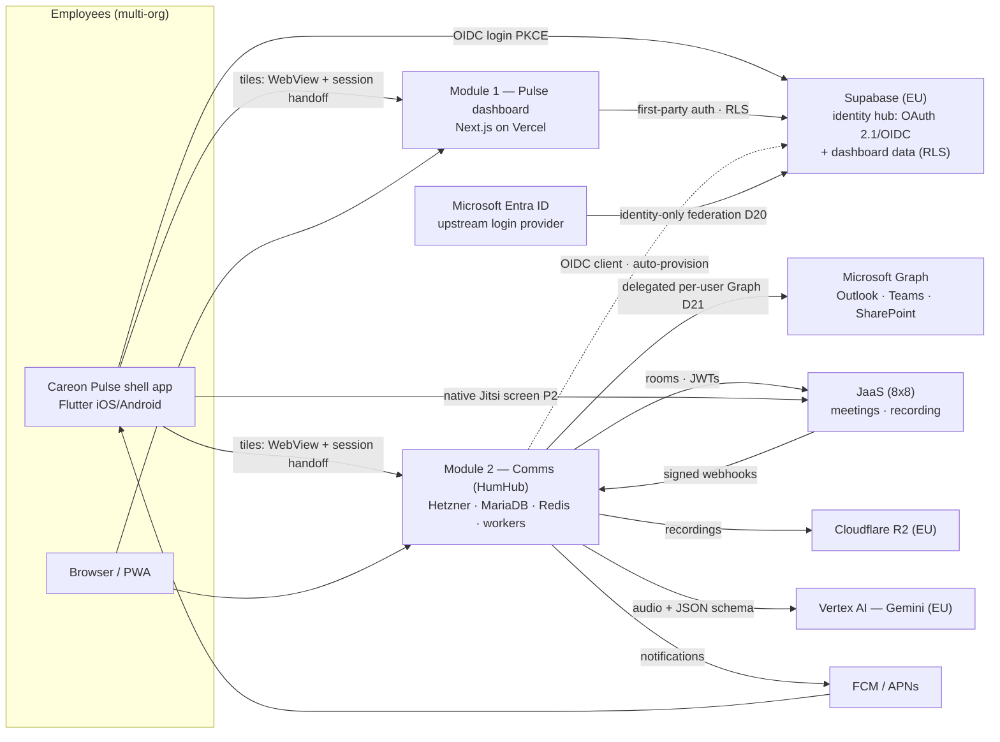
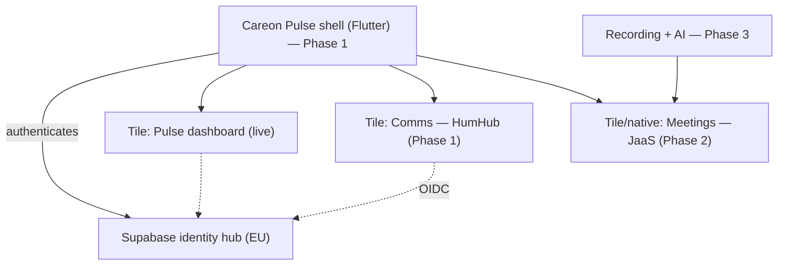
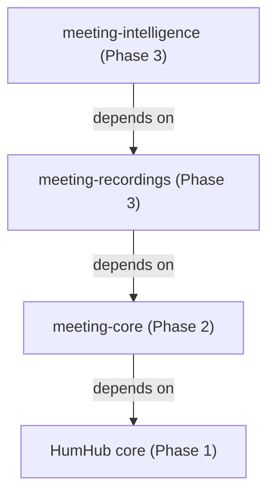
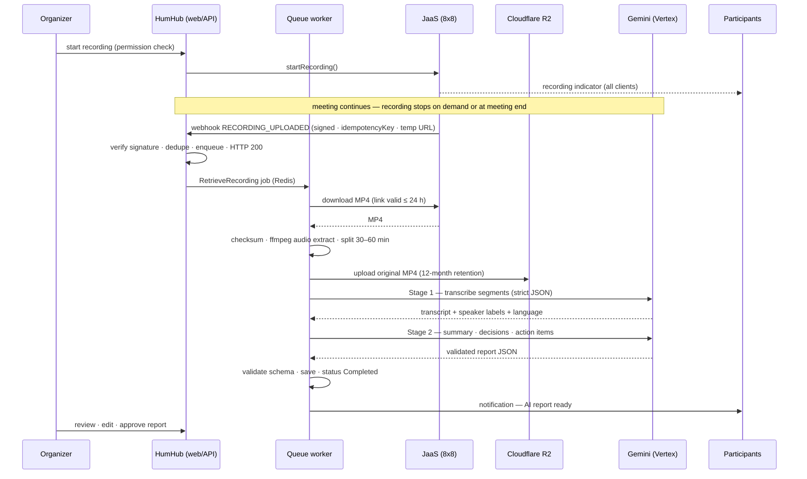

# Careon Pulse — Platform Blueprint

**Version:** 2.5 · **Date:** 21 August 2026 · **Status:** Approved for implementation · **Amends:** D21, calendar-only Graph writes with conflict-safe YAAZ event management · **Supersedes:** v2.4 (D22, Entra-gated employee lifecycle and JIT membership) · v2.3 (D21, delegated Microsoft 365 data plane in YAAZ) · v2.2 (D20, hybrid authentication / Entra ID federation) · v2.1 (D19, facturatie module) · v1.0 (single-app HumHub blueprint)
**Prepared by:** Bayaan Hub · **Product:** Careon Pulse · **Current organization:** TGC Groep (multi-org-ready)

This document is the implementation source of truth for **Careon Pulse**: a multi-module employee platform in which users sign in once and open the modules their account is entitled to — the healthcare KPI dashboard (live today), the communication platform, and audio/video meetings with optional recording and AI meeting documentation. It is the **umbrella guide for AI agents and developers across all Careon Pulse repositories**; repository-local AGENTS.md files govern local conventions and defer to this document for platform-level decisions. Decisions marked **Confirmed** must not be changed silently; propose alternatives explicitly with consequences (Section 2).

---

## 1. Executive Summary

Careon Pulse is delivered as a **shell + modules** platform. A custom Flutter **shell app** (iOS/Android) provides native login, a tile launcher, push notifications, and deep links; each tile opens a module. Modules are independent applications behind one identity: users exist once, sign in once, and see only the tiles their account is entitled to.

The **identity hub** is the existing Careon Pulse Supabase project (EU): Supabase Auth extended with its OAuth 2.1 / OIDC server, reusing the organization/member/role model already in production for the dashboard. **Module 1 — Pulse dashboard** is live: a Dutch healthcare KPI dashboard (Next.js on Vercel) with organization-scoped RLS and a hardened OpenAI-based assistant. **Module 2 — Communication** is HumHub (PHP 8 / Yii2 / MariaDB) on a Hetzner VPS deployed by Coolify: feeds, chat, Spaces, files, notifications — roughly 80% of a Speakap-class platform out of the box. **Module 3 — Meetings** adds JaaS (8x8) rooms through the custom `meeting-core` module, with a native Jitsi screen in the shell. The optional **recording + AI module** archives meeting recordings to Cloudflare R2 and produces transcripts, summaries, decisions, and action items via Gemini on Vertex AI (EU) — Gemini is used **only** for meeting intelligence; the dashboard assistant remains on its pinned OpenAI setup.

The platform is **multi-organization by design**: TGC Groep is the current organization, and further organizations can be onboarded later (each with its own memberships, entitlements, and its own HumHub installation, while identity stays central). For Microsoft 365 organizations, YAAZ additionally presents Outlook, calendar, Teams, SharePoint and shared documents through delegated Microsoft Graph access; the employee's existing Microsoft permissions remain authoritative (D21).

Delivery keeps the contracted phase structure — Phase 1 base platform, Phase 2 calling, Phase 3 recording & AI — extended in Phase 1 with the shell app and identity integration (additional scope, priced separately; Section 21). Hosting is heterogeneous by intent: Vercel for the dashboard, Supabase for identity and dashboard data, Hetzner + Coolify for HumHub and the processing pipeline, with JaaS, R2, and Vertex as managed external services.

## 2. Confirmed Decisions (Decision Log)

Any change to a Confirmed decision must be proposed as an explicit alternative with consequences (cost, scope, timeline) — never applied silently. D1–D12 originate in v1.0 (D4 revised); D13–D18 were added in v2.0; D19 was added in v2.1 (facturatie module); D20 was added in v2.2 (hybrid authentication — Entra ID federation, owner-confirmed 13 Aug 2026); D21 was added in v2.3 (delegated Microsoft 365 data plane in YAAZ, owner-confirmed 20 Aug 2026 following the client's explicit Office 365 request) and amended in v2.5 with the owner's explicit integrated-calendar request and autonomous delivery approval; D22 was added in v2.4 (group/app-role-gated JIT employee membership and lifecycle reconciliation, owner-confirmed 21 Aug 2026).

| # | Decision | Choice (Confirmed) | Rationale | Rejected alternatives |
|---|---|---|---|---|
| D1 | Comms platform base | HumHub (PHP 8 / Yii2) | Mature module system; ~80% of the comms feature set out of the box | Building comms from scratch |
| D2 | HumHub database | MariaDB in the Compose stack | Hard HumHub requirement — no PostgreSQL support | Supabase/PostgreSQL as HumHub's DB; managed MySQL |
| D3 | Meetings | JaaS (8x8) | Complete meeting UI, WebRTC infra, recording, webhooks, web + Flutter SDKs | LiveKit (more custom work) |
| D4 | Mobile apps — **revised v2.0** | Careon Pulse shell app: custom Flutter shell (login · launcher · WebView modules · native Jitsi screen) | A multi-module launcher cannot live inside HumHub's app; the shell owns identity, push, and deep links | HumHub-app fork (v1.0 choice); fully native apps per module |
| D5 | Phase-2 calling scope | In-app invitation: push → tap → join | OS-level ringing (CallKit/PushKit, full-screen intents) each exceed the module budget; future enhancements | Carrier-style ringing; PSTN/SIP/RTMP |
| D6 | Meeting AI | Gemini Flash-class multimodal via **Vertex AI, EU region**; model configurable | Structured JSON, audio+video capable, EU processing | Consumer AI Studio endpoint; hard-coded model |
| D7 | AI input strategy | Audio-first (ffmpeg); video frames only when JaaS reported screen sharing | ~10× cheaper and faster than full-MP4 uploads | Full MP4 by default |
| D8 | Recording storage | Cloudflare R2 (S3-compatible), EU jurisdiction | No egress fees, lifecycle rules, signed private downloads | Media in the database or on VPS disk |
| D9 | Queue | Redis + yii2-queue + Supervisor from Phase 1 | HumHub uses the queue anyway; avoids topology change | DB-backed queue (fallback only) |
| D10 | Comms hosting | Hetzner CX VPS + Coolify Cloud (GitHub push-to-deploy); provider-portable Compose | ~€11–17/month vs ~€30–45/month PaaS | Railway; Render |
| D11 | HumHub tenancy | One HumHub installation per organization | HumHub is not native multi-tenant; clean isolation | Shared multi-tenant HumHub |
| D12 | App distribution | Client-owned Apple/Google accounts; Phase-1 build ships **without** mic/camera permissions | Apple policy for single-company apps; faster first review | Bayaan-owned accounts |
| D13 | Platform shape | Multi-module shell + tile launcher; tiles shown per account **entitlement** | Client requirement; every future idea becomes a sellable module | Single-app platform (v1.0 shape) |
| D14 | Identity | The existing careonpulse **Supabase project (EU)** is the platform identity hub via its OAuth 2.1 / OIDC server; all modules are OIDC/first-party clients; **Keycloak is the documented fallback IdP** | Already hardened, org-scoped, EU; users exist once; external clients get identity-only scopes | Dedicated identity-only Supabase project; Keycloak as primary |
| D15 | Dashboard module | Careon Pulse dashboard stays Next.js on **Vercel**, first-party Supabase Auth unchanged | Live, gated, and production-hardened; no reason to move | Re-hosting on Coolify |
| D16 | Organizations | Multi-org from the start: TGC Groep now, more organizations onboardable later | The tenancy model already exists in production | Hard-coding a single org |
| D17 | AI vendors per module | OpenAI (pinned snapshot) stays dashboard-only; Gemini/Vertex is used only for meeting transcription & reports | Each module keeps its proven, audited AI regime | Consolidating on one vendor |
| D18 | Repositories | `careonpulse` stays a single-app repo and hosts the umbrella docs; shell, HumHub modules, and deploy live in sibling repos | The dashboard's CI gates are tuned to one Next.js app; Flutter + PHP would fight them | One physical monorepo |
| D19 | Facturatie module (v2.1) | Invoicing is a standalone route section (`/facturatie`, own module shell + menu) with its own Supabase schema **inside Module 1**, not a fifth repo or OIDC client. Access limited to `org_admin` + superadmins **with** org membership, enforced on four layers (launcher filter, server page gate, `requireOrgAdmin()` per API route, RLS `app.mag_facturatie_zien`); tile visibility is a precursor of D13 entitlements, not a replacement. No AI tools on invoice data in phase A (privacy grounds; D17 unchanged). Final PDFs live immutably in the platform's **first Supabase Storage bucket** (`facturen`, private, EU) with its own backup regime — D8 (R2) stays recordings/HumHub-backups only. E-mail dispatch is phase B; the transactional mail provider will be **one platform-wide choice** (dashboard + HumHub `SMTP_*` in `platform-deploy`, same sender domain/DKIM/SPF), settled with a DPA before the first real send. **Amendment 13 Aug 2026 (owner decision): the provider is Resend (US)**, deviating from the EU-sovereign proposal (Brevo) in client answer V17. Consequences, explicitly accepted by the owner: US jurisdiction (CLOUD Act) and DPF/SCC reliance for the recipient address and the attached invoice PDF — which for private clients implies GGZ care. Mitigations: DPA incl. SCCs signed **before** activation, dispatch fail-closed until then, and the provider isolated in one file (`mail.server.ts`) so swapping back stays a small change. The platform-wide clause (same provider for HumHub `SMTP_*`) stays in force. Full spec: `agent-handoff/15-facturatie.md`. | The CI gates are tuned to one Next.js app (D18) and hosting/auth stay unchanged (D15); D14 stays intact because invoice data lives under the dashboard plane's first-party sessions and RLS | Separate first-party Supabase app (allowed by D14 §4 but fights D18) |
| D20 | Authentication methods (v2.2, provisioning amended by D22) | **Hybrid authentication; login method is organization policy** (owner-confirmed 13 Aug 2026). The Supabase hub (D14) stays the single identity point for all modules; Microsoft **Entra ID federates into the hub as an upstream provider** (Supabase Azure provider; single-tenant app registration in the customer's tenant). Modules keep speaking OIDC to the hub and never see Entra. "Inloggen met Microsoft" is the primary path for TGC employees; e-mail/wachtwoord stays for platform administration, demo/e2e and break-glass. Identity linking requires verified-e-mail equality (UPN/primary mail must equal the account e-mail). Membership provisioning follows D22. Enforcement is phase 2: `sso_verplicht` per organization (exception: `platform_admins`), activated for TGC only after proven adoption. Full original spec: `agent-handoff/16-office365-yaaz-modules.md`. | Employees use the existing Microsoft work account and TGC's MFA/Conditional Access; ordinary employee passwords disappear from the Careon lifecycle while the Supabase hub and module OIDC contracts remain intact | Microsoft-only platform-wide (breaks superadmin outside the tenant, demo/e2e accounts, non-M365 organizations per D16, and break-glass); Entra as direct IdP per module (breaks D14, duplicates client registrations, loses the hook-0019 org/role claims) |
| D21 | Microsoft 365 data inside YAAZ (v2.3; calendar-write amendment v2.5) | **A separate, single-tenant Entra app registration gives YAAZ delegated Microsoft Graph access per employee** (owner-confirmed 20 Aug 2026 after the client's explicit request for SharePoint, Outlook/mail, Office 365, Teams and shared documents). This is a data plane, not login: D20's Entra→Supabase app remains identity-only and is never reused. YAAZ uses authorization-code + PKCE and `offline_access`; server-side access/refresh tokens are AES-256-GCM encrypted in MariaDB with per-user associated data and never sent to the browser. The connected Graph mail/UPN must exactly match the HumHub account e-mail. Read profile is default (`Mail.ReadBasic`, `Calendars.ReadBasic`, `Files.Read.All`, `Sites.Read.All`, `Team.ReadBasic.All`, `Channel.ReadBasic.All`). Mail, calendar and file writes have independent deployment flags and tenant consent, so enabling one never grants the others. **Calendar-only writes are approved on 21 Aug 2026:** delegated `Calendars.ReadWrite` lets the employee create, edit and cancel their own Outlook events in YAAZ; update/delete re-read a fresh ETag and use `If-Match`, never touch bodies or attendees, and refuse stale forms instead of overwriting a concurrent Outlook change. Graph operates as the signed-in employee, so Microsoft ACLs remain authoritative. Outlook occurrences are live, are never copied to MariaDB and are not transparently synchronized; drag/drop remains disabled. Mail send and file upload remain disabled pending separate acceptance. No application permissions, Teams-message reads, mail-body/attendee/attachment reads, tenant-directory reads, transparent two-way sync, or embedded Office editor. Full delivery/runbook: `agent-handoff/17-microsoft365-yaaz-deliverable.md`. | Delivers the client's requested working hub while retaining least privilege, tenant Conditional Access, per-user SharePoint/Teams rights, revocable consent and independent failure domains for login vs Office data. Capability-specific flags reduce consent blast radius; ETag preconditions add one Graph read per edit/delete but prevent lost updates. | Reusing the D20 login registration (scope coupling and excessive login consent); one all-writes switch for a calendar-only rollout; app-only Graph permissions (tenant-wide blast radius); storing provider tokens in the browser; transparent two-way sync or drag/drop without conflict handling; iframe embedding of Microsoft 365 |
| D22 | Entra employee lifecycle and JIT membership (v2.4) | **Entra is authoritative for employee identity and Careon eligibility; Careon remains authoritative for organization role and module/data entitlements** (owner-confirmed 21 Aug 2026). The D20 enterprise app requires assignment. TGC-IT assigns approved employees—preferably through a dedicated `Careon Pulse — Users` group—to app role `Careon.User`. On first Microsoft login, Careon validates Azure provider, exact `tid`, optional account-type claim `acct=0` (tenant member, never guest), `xms_edov`, exact normalized e-mail and the app-role claim in both application code and a service-role-only database transaction; an eligible identity receives exactly one TGC `member` row and an audit event. JIT can never create `org_admin`, superadmin or confidential module entitlements. Missing/partial configuration, missing/wrong account type, wrong tenant, absent role, guest/mismatch and concurrent duplicates fail closed. Existing break-glass/platform-admin paths remain. Directory inventory and offboarding use a third, dedicated least-privilege provisioning connector; neither D20 identity nor D21 personal-data credentials are repurposed. | Scales onboarding from manual invitations to the eligible workforce while retaining least privilege, deterministic role ownership and auditability. Normal employees need no Careon password/invite; delegated D21 Microsoft 365 access still requires one personal authentication. Group-based assignment may require Entra ID P1/P2; direct user assignment is the safe fallback. | Authorize every tenant object or e-mail domain (guests/shared/service/dormant accounts); bulk-create local passwords; map Entra directory roles to Careon admin roles; reuse D21 delegated tokens or the identity registration for directory synchronization |

## 3. System Architecture

Live WebRTC media flows directly between clients and JaaS — **no Careon Pulse server carries call streams**. The Hetzner plane handles the comms application, webhooks, the recording pipeline, and AI processing; Vercel serves the dashboard; Supabase is the single identity authority and the dashboard's datastore.

<!-- diagram: architecture -->

### 3.1 Runtime planes

| Plane | What runs there | Deployed via | From phase |
|---|---|---|---|
| Supabase (EU) | Supabase Auth + OAuth 2.1/OIDC server; organizations, members, roles, tile entitlements; Pulse dashboard schema (RLS) incl. facturatie (D19); audit + rate-limit tables; Storage bucket `facturen` (private — final invoice PDFs + org logo, own backup regime) | SQL migrations in `careonpulse/supabase` | live |
| Vercel | Pulse dashboard (Next.js 16), maintenance cron | Git push (Vercel) | live |
| Hetzner VPS | Nginx, HumHub (PHP-FPM) + meeting modules, MariaDB, Redis, queue worker, cron | Coolify Cloud, GitHub push-to-deploy | 1 |
| Client devices | Careon Pulse shell app (Flutter), browsers/PWA | App Store / Play (client accounts) | 1 |

### 3.2 External services

| Service | Purpose | Data exchanged | From phase | Pricing basis |
|---|---|---|---|---|
| Supabase | Identity hub + dashboard datastore + facturatie (D19: schema + private Storage bucket) | OIDC tokens, identity claims; dashboard data (RLS); invoice PDFs | live | Plan-based, EU project |
| Vercel | Dashboard hosting | HTTPS app traffic | live | Plan-based |
| JaaS (8x8) | Meeting UI, WebRTC media, recording | JWTs out; signed webhooks in; temporary MP4 downloads | 2 | MAU tiers + $0.01/recorded minute |
| Cloudflare R2 | Recording archive; HumHub DB backups | MP4 files, SQL dumps | 1 (backups), 3 (media) | ~$0.015/GB-month; no egress fee |
| Vertex AI (Gemini) | Meeting transcription + report | Audio segments out; validated JSON in | 3 | Per-token, model configurable |
| FCM / APNs | Push to the shell app | Title + deep link only | 1 | Free |
| GitHub + Coolify Cloud | CI/CD and orchestration (Hetzner plane) | Images, config | 1 | Coolify ~$5/month |
| Hetzner | VPS + snapshots | — | 1 | ~€5.49–10/month + 20% backup add-on |
| Transactional e-mail — **Resend** (facturatie phase B) | Invoice dispatch from the dashboard; later HumHub's `SMTP_*` on the same sender domain | Recipient address, invoice number, amount, due date; the PDF as attachment | phase B — built 13 Aug 2026, **fail-closed** | **Resend selected** (owner decision 13 Aug 2026, deviating from the EU-sovereign proposal — consequences recorded in D19). US jurisdiction: DPA **incl. SCCs** required. Still one platform-wide choice per D19. Build live but dispatch disabled (route answers 503) until the DPA is signed and the sender domain incl. DKIM/SPF is verified; free tier likely sufficient |
| Microsoft Entra ID + Microsoft Graph | D20 upstream employee login; D21 delegated Outlook, calendar, Teams, SharePoint/shared-document access in YAAZ | Identity claims to Supabase; per-user Graph responses and encrypted OAuth tokens on the YAAZ server | D20/D22 identity and lifecycle live; D21 `careon-m365` v0.5.0 live with read surfaces plus calendar-only create/edit/cancel, while mail/file writes remain disabled | Included with applicable Microsoft 365 licenses; tenant app registrations and admin consent owned by TGC-IT |

## 4. Identity & SSO

**Hub (Confirmed, D14).** The existing careonpulse Supabase project (EU region) is the platform's identity authority. It already provides Supabase Auth with cookie sessions, an organization/member model (`org_admin` / `member` per organization plus a platform-level superadmin), login rate limiting, and audit events — all in production. v2.0 adds two things: the **OAuth 2.1 / OIDC server** (so external modules can federate) and a per-account **tile entitlement** model (Section 5).

**Upstream provider (Confirmed, D20 + D22 — v2.4).** For organizations on Microsoft 365, **Entra ID federates into the hub as an upstream provider** (Supabase Azure provider; single-tenant app registration in the customer's tenant, redirect URI = the hub's `/auth/v1/callback`). The Entra optional claims `acct` and `xms_edov` are required before JIT activation so Careon can distinguish tenant members from guests and treat the returned e-mail as verified. The federation is invisible below the hub: modules keep speaking OIDC to the hub only. Login method is organization policy — hybrid by default (Microsoft primary for employees; e-mail/wachtwoord retained for platform administration, demo/e2e, break-glass), per-organization enforcement (`sso_verplicht`) is a later, explicit phase. D22 permits JIT creation of the least-privileged `member` row only for `acct=0`, the exact tenant and assigned `Careon.User` app role; identity linking still requires exact verified-e-mail equality. Original login spec: `agent-handoff/16-office365-yaaz-modules.md`; tracked rollout and acceptance: `docs/platform/PLATFORM_GAP_REGISTER.md` G01.

**Microsoft 365 data plane (Confirmed, D21 — v2.3; amended v2.5).** Office data is not an identity-token concern. YAAZ uses its own single-tenant Entra app and per-employee authorization-code + PKCE consent to call Microsoft Graph. The employee connects once after entering YAAZ; the server verifies that Graph `mail` or `userPrincipalName` exactly equals the HumHub account e-mail before storing an encrypted, renewable connection. The login registration remains identity-only, and Graph access can be revoked without breaking platform SSO. Read surfaces are inbox metadata (no bodies/attachments), a 14-day Outlook overview, a native Outlook overlay in the YAAZ week/month Calendar, joined Teams and channels, a configured SharePoint library or personal OneDrive root, and Microsoft Search results filtered by Microsoft's ACLs. The Calendar provider fetches only the visible `/me/calendarView` window, basic event fields and validated links; it stores no Graph events and degrades independently so local YAAZ events remain usable. Capability flags isolate optional writes. Calendar-only create/edit/cancel is approved: it requests only `Calendars.ReadWrite`, preserves event bodies/attendees, re-checks Graph ETags on edit/delete and refuses conflicts. Mail send and file upload remain disabled. The implementation and tenant handoff are in `agent-handoff/17-microsoft365-yaaz-deliverable.md`.

**Authentication flows.**

| Client | Flow |
|---|---|
| Shell app | Native OIDC authorization-code + PKCE against the Supabase authorize endpoint; tokens in secure storage; refresh handled by the shell |
| Pulse dashboard | Unchanged: first-party Supabase Auth (`@supabase/ssr` cookie sessions), enforced in `src/proxy.ts` and every API route |
| HumHub | OIDC client module against the project's discovery endpoint (`/.well-known/openid-configuration`); auto-provisions the local HumHub account on first login; `org_admin` claim maps to HumHub administrator |
| WebView tiles | The shell performs a one-time session handoff into the module (for Supabase-backed webapps: pass access + refresh token, module calls `supabase.auth.setSession()`; for HumHub: complete the OIDC redirect inside the WebView using the shell's session) — modules never show a second login screen |
| Future modules | Register as an OIDC client (or first-party Supabase app); appear as a tile; done |

**Claims & identifiers.** ID tokens carry the platform-wide subject UUID (`sub`), name, email, organization memberships with role, and tile entitlements (or a pointer to the entitlements endpoint). The Supabase `sub` is the stable cross-module identity: HumHub stores it as the external identity key, and it becomes the JaaS `context.user.id`.

**Blast radius.** External OIDC clients (shell, HumHub) receive **identity-scoped tokens only** — no data-API scopes against the Supabase project. The dashboard's data access continues to run through its own first-party sessions and RLS; the service-role key remains server-side in the dashboard plane only.

**Lifecycle.** Under D22, TGC-IT controls employee eligibility through the D20 enterprise-app assignment/app role while Careon administrators control roles and module/data entitlements. First eligible login may atomically create only a `member` membership. Organization role changes propagate at platform-token refresh. Disabling/removing an employee in Entra blocks the next interactive Microsoft login but does not revoke an already-issued Supabase refresh token by itself. Production offboarding therefore includes identity-hub blocking/session invalidation and D21 Graph-token deletion; the dedicated provisioning connector reconciles assignment/account state without reusing either D20 or D21 credentials. Tenant-side consent and Microsoft-session revocation remain TGC-IT controls.

**Phase-0 gate.** Supabase's OAuth server left beta in late 2025, so before any feature code: an end-to-end spike — shell login (PKCE), HumHub OIDC login, auto-provisioning, role claim, deactivation propagation, logout. If the spike fails on a hard blocker, the documented fallback is a **Keycloak** container on the Hetzner plane as the OIDC provider; every module only assumes "an OIDC provider", never a brand.

## 5. Shell App & Module Registry

<!-- diagram: modules -->

**Shell responsibilities (new build, repo `careonpulse-shell`).** Native login (Section 4); secure token storage and refresh; the **launcher**; push notifications (FCM/APNs — the shell owns the Firebase project; module backends send through it with payloads limited to title + deep link); deep links (`careonpulse://<module>/<path>`) into module screens; the WebView module container; the native Jitsi meeting screen from Phase 2; sensible offline/empty/error states; a per-tile kill switch.

**Module registry.** The launcher is server-driven: the shell fetches a tile registry from the identity plane — per tile: id, display name, icon, type (`webview` | `native`), URL or native route, required entitlement, minimum shell version, enabled flag. Shipping a new module is a registry entry plus an entitled account, not an app release.

**Entitlements (Confirmed, D13).** Module access is governed per account: organization role provides defaults, explicit per-account grants override. The launcher renders only entitled tiles, and **every module enforces the same entitlement server-side** — the launcher is convenience, not security. Entitlements are managed by administrators in the identity hub. The **Facturatie tile (D19)** is the first role-gated tile in the live registry — `zichtbaarVoor: "org_admin"`, filtered server-side before the registry reaches the client and re-enforced by the module itself — and is the working precursor of these per-account entitlements, not a substitute for them.

**WebView contract for modules.** Session handoff instead of login screens (Section 4); responsive mobile-first layouts with safe-area support; no auth flows that require popups or new tabs; file upload/download routed through shell handlers; the Pulse dashboard already satisfies all of this (mobile-first PWA, gated by its own e2e suite). **Documented exception (D19, client-approved):** the facturatie editor's embedded PDF preview is desktop-first — on small screens it opens the blob in a new tab, and once Module 1 runs as a shell tile, preview-open and PDF download must route through the shell handlers.

**Store posture.** Client-owned developer accounts (D12); the Phase-1 build ships without microphone/camera permissions, making Phase 2 a routine update. Apple's minimum-functionality rule (4.2) is satisfied by native login, launcher, push, deep links, and later the native meeting screen — the shell is an app with web content inside, not a wrapped website.

## 6. Capability Matrix

One row per capability: where it comes from and what we must do.

| Capability | Provided by | Our work | Phase |
|---|---|---|---|
| One login for everything (SSO), org roles, account lifecycle | Supabase (existing) + OAuth 2.1 server | Enable server mode; claims; spike | 1 |
| Tile launcher, per-account entitlements, push, deep links | — | **Build: shell app + registry + entitlements** | 1 |
| Healthcare KPI dashboard incl. AI-assistent | Careon Pulse dashboard (live) | Embed as tile (session handoff) | 1 |
| Invoicing (facturatie): PDF invoices with live preview, contacts, admin-only | Built inside Module 1 (D19, live) | E-mail dispatch (phase B, platform-wide mail provider) | 1 |
| Feed, announcements, comments, reactions, mentions | HumHub core | Configure | 1 |
| Private/group messaging + attachments | HumHub Mail module | Enable + configure | 1 |
| Profiles, directory, groups, Spaces, files, search, notifications | HumHub core | Configure; OIDC auto-provisioning | 1 |
| Branded comms web + PWA | HumHub theming | Custom theme (Careon brand) | 1 |
| 1:1 + group audio/video, screen share, moderation, reconnection | JaaS | Integrate (web embed + native screen in shell) | 2 |
| Meeting rooms, invitations, permissions, JWTs, sessions | — | **Build: `meeting-core`** | 2 |
| Recording capture + consent indicator | JaaS recording add-on | Enable + controls | 3 |
| Recording archive, playback, retention | — | **Build: `meeting-recordings`** | 3 |
| Transcript, summary, decisions, action items + approval UI | Gemini (Vertex EU) | **Build: `meeting-intelligence`** | 3 |
| Usage metering + monthly export | — | Build (meeting modules) | 3 |
| Additional organizations | Supabase org model (existing) | Onboard: org row + members + HumHub install | later |
| Future modules/dashboards | — | Web app + OIDC client + registry entry | per module |
| OS-level call ringing, PSTN/SIP, action items → tasks, SSO/LDAP federation | — | Explicit future enhancements | future |

## 7. Organizational Model & Tenancy

**Source of truth** for who exists, in which organization, with which role and entitlements: the identity hub (`organizations`, `organization_members` with `org_admin`/`member`, platform superadmin). The Pulse dashboard is already organization-scoped through RLS on this model; the demo organization stays isolated per the repo's guardrails.

**Current state (Confirmed, D16).** TGC Groep is the active organization. Additional organizations can be onboarded later: a new organization row, its memberships and entitlements — and, for the comms module, a **new HumHub installation** (D11: one install per organization; on Coolify that is one additional project or server). Identity stays central; the dashboard is multi-org natively.

**Inside an organization**, the HumHub Space model from v1.0 is unchanged: a company-wide Space, a private management Space, Spaces per department/location/project, and temporary working groups, each with its own members, content, permissions, and Space administrators. Role mapping: identity-hub `org_admin` → HumHub administrator; `member` → regular user; the platform superadmin (Bayaan Hub operations) never flows into client-visible module roles automatically.

## 8. Repository & Version Strategy

Four repositories, one platform (Confirmed, D18):

| Repository | Contents | Deploys to | Notes |
|---|---|---|---|
| `careonpulse` | Pulse dashboard (Next.js) + **umbrella platform docs** (`docs/platform/`) | Vercel | Existing CI gates (`verify:ci`, release gates) stay untouched; AGENTS.md gains a pointer section to the umbrella docs |
| `careonpulse-shell` | Flutter shell app | App Store / Play (client accounts) | Own thin AGENTS.md deferring to the umbrella |
| `humhub-meeting-modules` | `meeting-core`, `meeting-recordings`, `meeting-intelligence` | Installed into HumHub | Independent semver per module |
| `platform-deploy` | Docker Compose, Nginx config, env templates, backup/restore scripts, `VERSIONS.md` | Hetzner via Coolify | `main` → production, `develop` → staging |

**Version pinning.** Phase 0 records the compatibility matrix in `platform-deploy/VERSIONS.md`: HumHub stable release, PHP 8.x, MariaDB LTS, Flutter SDK, `jitsi_meet_flutter_sdk` (actively maintained; iOS 15.1+), and the Supabase client/OIDC integration versions. Exact versions are pinned **before feature code**. Upstream security releases are applied under maintenance.

**Documentation rule for agents.** Platform-level decisions live in `careonpulse/docs/platform/PLATFORM_BLUEPRINT.md` (this document). Each repository's AGENTS.md governs local conventions only and links back here. The dashboard's existing conventions (Biome, co-location, shadcn rules, conventional commits) are unaffected.

**Licensing.** Detailed license analysis remains deferred by instruction and must complete before production release (HumHub CE terms, marketplace items, Flutter/npm dependencies).

## 9. Custom HumHub Modules (Meetings)

All meeting functionality is packaged as three internal HumHub modules with a strict dependency chain. Commercially, `meeting-recordings` and `meeting-intelligence` are sold to the client together as one optional module.

### 9.1 `meeting-core` (Phase 2)

JaaS configuration (App ID, key ID, private-key reference); secure room lifecycle — unique private room names associated with users or Spaces; participant invitations; **server-side generation of short-lived RS256 JWTs** with the moderator flag derived from role; meeting permissions (who may start calls, per Space); the JaaS webhook endpoint with signature verification and idempotency store; meeting/participant session persistence; meeting notifications (invitation, missed, started); raw usage-event tracking; shared REST endpoints consumed by the web UI and the Flutter app; feature flags returned by the server so mobile builds can enable/disable meeting UI.

### 9.2 `meeting-recordings` (Phase 3, depends on core)

Recording permissions; start/stop controls with recording-state indicators synchronized across clients; recording lifecycle webhooks; **immediate MP4 retrieval within the 24-hour JaaS window** with retries and a reconciliation job; checksum verification; upload to R2 plus a metadata row; playback and download through time-limited signed URLs behind permission checks; retention (12-month default) with automated deletion; a recording archive per meeting and Space.

### 9.3 `meeting-intelligence` (Phase 3, depends on recordings)

Media preparation (ffmpeg audio extraction, 30–60-minute segments, compression as needed; frame sampling **only** for meetings where JaaS reported screen sharing); **Stage 1** transcription per segment with a strict JSON schema (timestamps, speaker labels, detected language), every segment persisted and validated; **Stage 2** aggregation into the final report — summary, key discussion points, decisions, action items with potential owner and mentioned deadline, important topics, open questions, and relevant screen-content observations; schema validation with bounded retries on malformed output; a processing-status state machine surfaced in the UI; human review — edit speaker names, transcript text, summary, and action items, with an explicit organizer **approval** step; usage metering (recorded seconds, processed seconds, Gemini usage, billable minutes per billing period); the model name and prompt/schema version stored on every report; the model is configurable in administration, never hard-coded.

## 10. Meetings — JaaS Integration

### 10.1 Web

The meeting page embeds the JaaS iFrame API. The HumHub backend creates the room, determines moderator permissions, and returns a signed JWT to the browser. **The JaaS private signing key never reaches a client.**

### 10.2 Flutter

`jitsi_meet_flutter_sdk` is integrated into the Careon Pulse shell app (D4/D13). Module WebViews trigger a native join through the shell's bridge; the native meeting screen provides microphone and camera controls, camera switching, screen sharing where the platform supports it, leave, and emits meeting-state events back to the shell. This WebView-to-native bridge remains the most sensitive Phase-2 integration and is de-risked by Spike B in Phase 0.

### 10.3 Calling flow (Phase 2 scope — Confirmed, D5)

Entry points: a colleague's profile, a messaging conversation, or a Space action. The backend checks permissions, creates the `meeting_session`, generates participant JWTs, and sends in-app plus push invitations; tapping the invitation joins the JaaS room; status updates flow back via webhooks. **Explicitly out of Phase 2 scope:** OS-level ringing (CallKit/PushKit, Android full-screen intents), guaranteed invitations when the app is force-closed beyond normal push behaviour, and any PSTN/SIP/RTMP telephony. These are future enhancements with their own budgets.

### 10.4 JWTs and MAU

JWTs are short-lived (target ≤ 2 hours), RS256, signed server-side, with `context.user.id` set to the user's Supabase subject UUID (the platform-wide stable identity, Section 4). Note: available sources indicate JaaS may count an MAU **per device** a user joins from; this must be verified with 8x8 (Open Questions). It is commercially irrelevant at this size — even at two devices per employee, 40 employees ≈ 80 MAU against the Basic plan's 300.

## 11. Recording Pipeline & Storage

JaaS charges **$0.01 per recorded minute** and retains completed recordings only **~24 hours**, so retrieval is automated and immediate. A recording session can be up to six hours, and the MP4 reflects the **recorder's layout/perspective** — content not visible in that layout is not in the file, which bounds what Gemini can analyze.

<!-- diagram: sequence -->

Workflow: (1) an authorized organizer starts recording; (2) every participant sees the indicator; (3) JaaS records; (4) JaaS sends lifecycle webhooks; (5) `RECORDING_UPLOADED` supplies a temporary authenticated link; (6) a worker downloads the MP4 immediately; (7) the checksum is verified and the file uploaded to R2; (8) metadata is saved in MariaDB; (9) the recording appears on the meeting page; (10) AI processing starts asynchronously.

**Storage (Confirmed, D8).** R2 bucket with the EU jurisdiction option; objects under `recordings/{meetingId}/{recordingId}.mp4`; nightly database dumps under `backups/`. MP4s are **never** stored in the database or on the VPS disk beyond temporary processing. The database stores: object key, file size, MIME type, duration, checksum, storage status, owner, meeting reference, created date, retention date, deletion status. Playback and download use temporary signed URLs (target TTL ≈ 15 minutes) after a permission check. A bucket lifecycle rule acts as a safety net at retention + grace period; the standard commercial retention is **12 months**.

## 12. AI Meeting Intelligence (Gemini)

**Account & endpoint (Confirmed, D6).** A paid Gemini account owned by the client or an approved production account (ownership: Open Questions), accessed through **Vertex AI with an EU processing region** (e.g. `europe-west4`, subject to model availability). The model is a current stable Gemini **Flash-class multimodal** model, selected in administration and recorded on every report — never hard-coded.

**Required output.** Full timestamped transcript; speaker labels where technically possible; detected language; meeting summary; key discussion points; decisions; action items with potential owner and mentioned deadline; important topics; open questions; relevant observations from shared screens or presentations. All output is structured JSON validated against a schema.

**Two-stage pipeline.** Nothing is requested in one uncontrolled response. *Stage 1:* long recordings are split into 30–60-minute segments; each segment yields timestamped transcript JSON with speaker labels and language; every segment is persisted and validated before proceeding. *Stage 2:* the merged transcript goes in; the final report comes out — summary, decisions, action items, de-duplicated topics — and is saved with model and prompt/schema version.

**File limitations.** Uploads to the model are temporary and size-limited, hence the audio-first strategy (D7): ffmpeg audio extraction by default, compression and segmenting as needed, and video/frame analysis only when JaaS events show screen sharing occurred. The original MP4 is always retained in R2 independent of Gemini.

**Accuracy and human control.** Diarization produces `Speaker 1`, `Speaker 2`, …; mapping voices to employee names cannot be guaranteed from the composite recording. The UI therefore allows editing speaker names, transcript text, summaries, and action items, and requires explicit organizer **approval** before a report is final. Gemini can only analyze what the recording contains; content shown too briefly or outside the recorded layout may be missed. Malformed or schema-invalid responses trigger bounded retries and then a visible `Failed` state.

**Healthcare context.** Meetings at a zorg organization can capture patient information. Recordings, transcripts, and reports are therefore treated as potentially special-category data: processing stays in EU regions end to end, access defaults to organizer + administrators (Section 18), the consent notice is mandatory before joining a recorded meeting, and the retention period is explicitly confirmed with the client.

## 13. Background Processing

Redis + a Yii-compatible queue worker under Supervisor (its own container), plus a cron scheduler. A database-backed queue is acceptable only as a temporary minimal deployment; the architecture assumes Redis from Phase 1 (D9). All jobs are **idempotent** — safe to re-run.

| Job | Purpose |
|---|---|
| ProcessJaasWebhook | Validate, dedupe, persist, and fan out webhook events |
| RetrieveRecording | Download the MP4 via the temporary link (≤ 24 h) |
| VerifyChecksum | Integrity check before storage |
| UploadToR2 | Move the MP4 to permanent object storage |
| PrepareMedia | ffmpeg audio extraction, segmentation, optional compression |
| TranscribeSegment | Stage 1 Gemini call per segment |
| AggregateReport | Stage 2 Gemini call; save final report |
| NotifyParticipants | Meeting/report notifications incl. push |
| CleanupTempFiles | Delete temporary processing files |
| RetryFailed | Re-schedule failed jobs with exponential backoff |
| ReconcileRecordings | Cron: find recordings that never completed while the 24 h window is open |
| EnforceRetention | Cron: delete recordings/reports past retention |
| ExportMonthlyUsage | Cron: produce the monthly usage export |

Processing states surfaced to users and admins: *Waiting for recording → Downloading → Uploading → Transcribing → Generating report → Completed*, with *Failed* and *Retry scheduled* branches.

## 14. Webhook Endpoint

A dedicated HTTPS-only route (e.g. `/meeting/webhook/jaas`). Requirements: verify the JaaS webhook signature and reject invalid requests; store every event's `idempotencyKey` behind a unique index and silently drop duplicates; never assume chronological delivery — the session/recording state machine tolerates out-of-order events; persist the raw payload and the original event timestamp; return a successful HTTP response quickly and queue all expensive work; keep retry and failure logs. Events consumed: room created, participant joined/left, recording started/ended/uploaded, meeting ended, usage events.

## 15. Data Model

Conventions: InnoDB, `utf8mb4`, `created_at`/`updated_at` on every table, foreign keys indexed. Yii migrations live in the owning module. HumHub users/Spaces are referenced by their existing IDs; each HumHub user additionally stores the Supabase subject UUID as its external identity key (Section 4).

**`meeting_session`** — one row per meeting.

| Field | Type | Notes |
|---|---|---|
| id | PK bigint | |
| jaas_session_id | varchar, unique | From JaaS |
| room_name | varchar, unique | Unguessable |
| space_id | FK → space, nullable | Null for direct calls |
| created_by | FK → user | |
| title | varchar | |
| status | enum | scheduled / active / ended / cancelled |
| started_at / ended_at | datetime | |
| recording_enabled | bool | |

**`meeting_participant`**

| Field | Type | Notes |
|---|---|---|
| meeting_id | FK → meeting_session | Composite index with user_id |
| user_id | FK → user | |
| jaas_participant_id | varchar | |
| joined_at / left_at | datetime | |
| role | enum | moderator / participant |

**`meeting_recording`**

| Field | Type | Notes |
|---|---|---|
| id | PK | |
| meeting_id | FK | |
| jaas_recording_id | varchar, unique | |
| object_key | varchar | R2 key |
| duration_seconds / file_size / mime_type / checksum | — | |
| processing_status | enum | See Section 13 states |
| retention_date | date, indexed | Drives EnforceRetention |
| deleted_at | datetime, nullable | Soft-delete audit |

**`meeting_transcript_segment`**

| Field | Type | Notes |
|---|---|---|
| meeting_id / recording_id | FK | |
| segment_number | int | Unique with recording_id |
| start_ts / end_ts | decimal seconds | Within the recording |
| speaker_label | varchar | e.g. "Speaker 1" |
| speaker_user_id | FK, nullable | Set when a human confirms |
| text | mediumtext | |
| language | varchar | Detected |

**`meeting_ai_report`**

| Field | Type | Notes |
|---|---|---|
| meeting_id | FK, unique | One report per meeting |
| summary / topics / decisions | JSON | Schema-validated |
| status | enum | draft / approved / failed |
| model_used | varchar | |
| prompt_schema_version | varchar | |
| approved_by / approved_at | FK / datetime, nullable | |

**`meeting_action_item`**

| Field | Type | Notes |
|---|---|---|
| meeting_id | FK | |
| description | text | |
| assigned_user_id | FK, nullable | |
| mentioned_deadline | date, nullable | As spoken, not enforced |
| completed | bool | |

**`meeting_webhook_event`**

| Field | Type | Notes |
|---|---|---|
| idempotency_key | varchar, **unique** | Dedupe guard |
| event_type | varchar, indexed | |
| jaas_timestamp | datetime | Original event time |
| payload | JSON | Raw |
| processing_status | enum | received / processed / failed |
| received_at | datetime | |

**`meeting_usage`**

| Field | Type | Notes |
|---|---|---|
| meeting_id | FK | |
| recorded_seconds / processed_seconds | int | |
| storage_bytes | bigint | |
| gemini_usage | JSON | Tokens per stage |
| billable_minutes | int | Rounded per policy |
| billing_period | char(7), indexed | e.g. "2026-09" |

Relationships: a session has many participants and recordings; a recording has many transcript segments; a session has one AI report and many action items; usage aggregates per session per billing period.

## 16. Notifications

HumHub's notification infrastructure carries comms and meeting events; mobile push is delivered through the Careon Pulse shell app (FCM/APNs — module backends send through the shell's Firebase project) with deep links into posts, messages, meetings, and reports. Push payloads contain only a title and deep link — no message or transcript content.

| Notification | Audience | Phase |
|---|---|---|
| Incoming meeting invitation | Invitees | 2 |
| Meeting starting | Participants | 2 |
| Missed invitation | Invitee | 2 |
| Recording completed | Organizer | 3 |
| Transcript processing completed | Organizer | 3 |
| Processing failure | Administrators | 3 |
| AI report ready | Authorized participants | 3 |
| Action item assigned | Assignee | 3 |

## 17. Administration

A meeting administration area provides: enabling/disabling the meeting modules globally and per Space; JaaS App ID and public/private key configuration; Gemini/Vertex configuration (project, region, model); R2/S3 configuration; recording retention setting (default 12 months); recording permissions; AI-processing and report-visibility permissions; a usage overview with monthly CSV export; a failed-jobs view with reprocessing; and deletion of recordings and reports with an audit note. Tile entitlements per account — which modules an account can open — are managed in the identity hub and enforced by every module server-side. **Secrets live in environment variables or the deployment secret store — never in ordinary database fields or source control.**

## 18. Security & Privacy Model

**Transport & access.** HTTPS everywhere with automatic certificates. Every meeting, recording, transcript, and report route enforces HumHub authentication plus membership and role checks; media is reachable only through short-lived signed URLs. Meetings are joinable only via invitation/permission — room names are unguessable and JaaS access requires our server-signed JWT.

**Keys & webhooks.** The RS256 private key exists only server-side; JWTs are short-lived; webhooks are signature-verified and idempotent (Section 14). External OIDC clients receive identity-scoped tokens only — no data-API scopes against the Supabase project — and the service-role key never leaves the dashboard's server plane. D21 Graph access is deliberately separate: delegated tokens stay server-side, are AES-256-GCM encrypted with a deployment key plus per-user associated data, and are deleted on disconnect/user deletion. The browser receives rendered results and Microsoft web links, never bearer or refresh tokens. Secrets and the encryption key live only in the deployment secret store; key rotation requires an explicit reconnect/rotation runbook.

**Data locations.** Supabase project in an EU region; Vercel for the stateless dashboard runtime; Hetzner (Germany/Finland); R2 with the EU jurisdiction option; Vertex AI in an EU region. 8x8/JaaS processing regions must be confirmed and recorded (Open Questions). Facturatie (D19): invoice rows and PDFs live in the same EU Supabase project (schema + private Storage bucket `facturen`); statutory retention is 7 years (10 for immovable property), enforced by excluding issued invoices from every prune routine.

**GDPR.**

- Recording is always visible: the JaaS indicator plus a notice text shown before joining a recorded meeting (final wording: Open Questions, with client's counsel).
- Data-processing agreements (verwerkersovereenkomsten) with 8x8, Cloudflare, and Google are the client's responsibility to execute; we supply the processing inventory (this document).
- Data minimization: push payloads carry no content; Gemini receives extracted audio, not raw video, by default.
- Microsoft 365 (D21): inbox access is metadata-only (`Mail.ReadBasic`), Microsoft ACLs govern Teams/files/search, and Graph content is rendered transiently rather than copied into Careon tables. Calendar-only `Calendars.ReadWrite` was separately approved on 21 Aug 2026; it changes only the signed-in employee's own event subject, location and timing and never reads/writes bodies or attendees. Mail/file writes remain disabled. Calendar subjects and filenames may still reveal health or employment context, so administrators must keep YAAZ membership aligned with employment and TGC must include this processing in its privacy/security register.
- Right to erasure: administrator deletion of recordings/reports plus automated retention deletion; deletions are audited.
- Employees are informed through the client's internal policy; the platform is an internal tool, not public.
- Facturatie (D19): storing invoice contacts **including e-mail addresses** is a new processing activity (client-approved 9 Aug 2026) — a deliberate exception to the dashboard's data-minimization line (referrer e-mails are not stored; private debtors are reduced to a label). Abandoned invoice drafts are pruned after 180 days; issued invoices are retention-locked. The AI assistant gets no read or write tools on invoice data. **Phase B (e-mail dispatch, built 13 Aug 2026):** the recipient address of every send attempt is logged in `careon_facturatie_maillog` — same processing activity as the invoice contacts (contact details incl. e-mail, client-approved V18), readable only under RLS, excluded from every prune (7-year administration), and deliberately kept **out of** the `facturatie.factuur.send` audit event. **Resend (US) is the new sub-processor — DPA incl. SCCs PENDING**, to be signed by the owner (owner decision 13 Aug 2026 deviating from the EU-sovereign proposal; transfer-risk analysis recorded in D19). Until the credentials are set the dispatch route is fail-closed (503), so no personal data reaches the provider.
- Healthcare context (TGC Groep): recordings, transcripts, and AI reports are treated as potentially special-category data — access defaults to organizer + administrators, the consent notice precedes every recorded meeting, and retention is explicitly confirmed with the client.

**Server & secrets.** SSH keys only, firewall (Hetzner Cloud firewall + host), unattended security updates, least-privilege R2 token scoped to a single bucket, database not exposed publicly, secrets via the deployment environment store. Backups are stored in R2 and the restore procedure is rehearsed as part of acceptance.

## 19. Deployment Architecture

**Three planes, deliberately heterogeneous (D10, D14, D15).**

**Vercel — dashboard.** Deploys on git push from `careonpulse`; environment per the repo's `.env.example` (Supabase keys, OpenAI, cron secret); Vercel Cron drives the maintenance route; stateless — nothing to back up beyond Supabase. **Exception (D19):** Supabase DB backups/PITR do **not** cover Storage objects — the `facturen` bucket carries a 7-year statutory obligation and needs its own backup routine (periodic server-side copy, plus PDF regeneration from the frozen row snapshots with `pdf_sha256` recheck as documented fallback); see `DISASTER_RECOVERY.md`.

**Supabase — identity + dashboard data.** EU-region project; schema managed exclusively through `careonpulse/supabase/migrations` (applied in file order); OAuth server configuration (registered clients: shell, HumHub, future modules) treated as infrastructure config and documented in the umbrella docs; backups per Supabase plan (point-in-time recovery recommended once meetings go live).

**Hetzner + Coolify — comms & pipeline.** One Hetzner CX VPS (start 4 GB, upgrade path 8 GB) runs Docker Compose — nginx, humhub-php, mariadb, redis, worker, cron — orchestrated by Coolify Cloud (~$5/month) with GitHub push-to-deploy from `platform-deploy`, automatic SSL, and a staging project on a subdomain. The Compose file stays provider-portable.

**Environment variables — Hetzner plane.**

| Variable | Purpose |
|---|---|
| DB_HOST / DB_NAME / DB_USER / DB_PASS | MariaDB connection |
| HUMHUB_BASE_URL | Canonical comms URL |
| OIDC_ISSUER_URL / OIDC_CLIENT_ID / OIDC_CLIENT_SECRET | HumHub → Supabase identity federation |
| M365_GRAPH_ENABLED / M365_GRAPH_TENANT_ID / M365_GRAPH_CLIENT_ID / M365_GRAPH_CLIENT_SECRET | D21 YAAZ delegated Graph registration (separate from D20 login) |
| M365_GRAPH_REDIRECT_URI / M365_GRAPH_TOKEN_KEY | Exact Entra callback and base64 32-byte AES-256-GCM key |
| M365_GRAPH_MAIL_WRITE_ENABLED / M365_GRAPH_CALENDAR_WRITE_ENABLED / M365_GRAPH_FILES_WRITE_ENABLED | Capability-specific delegated writes; each defaults to `0`. Only calendar is approved for TGC at v2.5 |
| M365_GRAPH_WRITE_ENABLED | Backwards-compatible all-writes switch; default `0` and not used for the calendar-only rollout |
| M365_GRAPH_SHARED_DRIVE_ID / M365_GRAPH_SHARED_FOLDER_ID | Optional SharePoint target |
| M365_GRAPH_TIMEZONE / M365_GRAPH_IANA_TIMEZONE | Matching Windows Graph-response zone and IANA PHP/YAAZ rendering zone |
| SMTP_HOST / SMTP_USER / SMTP_PASS / SMTP_FROM | Transactional email |
| REDIS_HOST | Queue/cache |
| JAAS_APP_ID / JAAS_KEY_ID / JAAS_PRIVATE_KEY_PATH / JAAS_WEBHOOK_SECRET | JaaS identity, signing, webhooks |
| R2_ACCOUNT_ID / R2_ACCESS_KEY_ID / R2_SECRET_ACCESS_KEY / R2_BUCKET | Object storage |
| VERTEX_PROJECT_ID / VERTEX_LOCATION / GEMINI_MODEL / GEMINI_MAX_RETRIES | Meeting AI (EU region; configurable model) |
| RECORDING_RETENTION_MONTHS | Default 12 |
| PUSH_FCM_CREDENTIALS | Service account for the shell's Firebase project |
| APP_ENV | production / staging |

Shell app configuration (Supabase URL, OIDC client id, tile-registry endpoint) is build-time config in `careonpulse-shell`; dashboard configuration stays defined by the repo's own `.env.example`. The facturatie **phase-B mail variables now exist** (provider chosen: Resend, D19 amendment): `CAREON_MAIL_RESEND_API_KEY`, `CAREON_MAIL_AFZENDER_EMAIL` and `CAREON_MAIL_AFZENDER_NAAM` (plus optional `CAREON_MAIL_RATE_LIMIT_PER_MINUTE` / `_PER_DAY`) — **server-side only, never `NEXT_PUBLIC_`**, kept in the Vercel secret store. They stay **empty until the DPA is signed and the sender domain (DKIM/SPF) is verified**; while empty the dispatch route is fail-closed (503). Go-live checklist: `PRODUCTION_MODE.md`.

**Backups & restore (Hetzner plane).** Nightly `mysqldump` + uploaded files to R2 (`backups/`), 30 daily + 12 monthly; weekly Hetzner snapshots (backup add-on, +20% of server price); the restore procedure lives in `platform-deploy` and is rehearsed once before Phase-1 acceptance.

**Operations.** Docker log rotation; health endpoints (`/health` app+DB+Redis, `/health/queue`) monitored by Coolify plus an external uptime monitor; processing failures notify administrators; migrations run on deploy. Deployment checklist per environment: DNS → SSL → env set → migrations → cron verified → queue verified → OIDC discovery reachable and login tested → JaaS webhook reachable and signature-tested → push tested → backup verified → restore drill (production, once).

## 20. User Journeys

**Signing in.** An employee opens the Careon Pulse app, signs in once against the identity hub, and lands on the launcher showing exactly the tiles their account is entitled to; opening a tile enters that module with no second login.

**Starting a call.** An employee opens a colleague's profile or a Space, taps the call action, and the platform checks permissions, creates the room, and issues JWTs; invitees receive in-app and push notifications; tapping joins the JaaS meeting in the app or browser; availability/session status updates via webhooks.

**Recording a meeting.** An authorized organizer starts recording; all participants see the indicator; on stop or meeting end, JaaS finalizes the file and fires webhooks; the platform downloads, verifies, and archives the MP4 to R2; the recording appears on the meeting page for authorized users.

**Receiving the AI report.** After archiving, processing starts automatically with visible status; on completion, authorized participants are notified; the report shows summary, decisions, and action items alongside the timestamped transcript; the organizer edits speaker names or text where needed and approves the final version.

## 21. Commercial Structure

**One-time development.**

| Phase | Deliverable | Price |
|---|---|---|
| 1 | Base platform — client fully live (web, PWA, branded mobile apps) | €4,000 |
| 2 | Calling module (JaaS meetings, web + mobile) | €1,000 |
| 3 | Recording + AI documentation module | €1,000 |
| | **Total** | **€6,000** |

**Recurring (client-facing).** Application hosting: **€500/year**. JaaS subscription (starts at Phase 2 go-live), passed through at the € equivalents of 8x8's list prices:

| JaaS plan | Monthly active users | Price |
|---|---|---|
| Developer | up to 25 | Free |
| Basic — *selected (40 users)* | up to 300 | €99/month |
| Standard | up to 1,500 | €499/month |
| Business | up to 3,000 | €999/month |
| Enterprise | 3,000+ | Custom |

Overage on paid plans: €0.99 per additional MAU. Fixed recurring total: €500 + 12 × €99 = **€1,688/year**.

**Usage-based (Phase 3).** €0.04 per recorded **and** AI-processed minute (€2.40/hour), metered by the platform (Section 15, `meeting_usage`), invoiced monthly in arrears, no minimum.

| Monthly recorded volume | Usage charge |
|---|---|
| 1 hour | €2.40 |
| 10 hours | €24 |
| 25 hours | €60 |
| 50 hours | €120 |
| 100 hours | €240 |

**Scope addition (v2.1).** The facturatie module (D19) is additional, client-requested scope inside Module 1; if it is later sold as a separate module, its tile/entitlement shape (D13) already supports that split.

**Scope addition (v2.0).** The shell app, identity integration, and dashboard-tile work are additional scope relative to this contracted structure and are quoted separately (TBD). The figures below are unchanged for the originally contracted scope.

**Internal cost basis (not client-facing).** Infrastructure ≈ €11–17/month (Hetzner CX ~€5.49–10 + 20% backup add-on + Coolify ~$5) against the €500/year fee. Per processed hour: JaaS recording $0.60 (at $0.01/min) + Gemini Flash audio-first (low single-digit cents) + R2 storage (~$0.015/GB-month) against €2.40 charged. Reference point: 8x8's own transcription add-on lists at **$0.06/minute for a transcript alone** — our €0.04/minute includes the full AI report. Each additional resold installation adds roughly €9–14/month of infrastructure (one more Hetzner server + $3 Coolify).

## 22. Implementation Roadmap

No calendar dates (Confirmed): phases are sequenced at Bayaan Hub's discretion, each ending with an acceptance gate on staging.

### Phase 0 — Audit & Foundations

- **Objective:** eliminate the two integration risks and stand up the delivery pipeline before feature code.
- **Tasks:** compatibility matrix in `VERSIONS.md`; create `careonpulse-shell`, `humhub-meeting-modules`, `platform-deploy`; provision Hetzner + Coolify; deploy a skeleton HumHub to staging; **Spike A — identity:** Supabase OAuth server end-to-end (shell PKCE login, HumHub OIDC login, auto-provisioning, role claim, deactivation, logout; Keycloak fallback decision); **Spike B — meetings:** shell WebView ↔ native Jitsi bridge; start the client's Apple/Google developer-account enrollment immediately (legal entity per Open Questions).
- **Acceptance:** both spikes pass or the fallback is invoked; pinned versions install cleanly; push-to-deploy works on both planes.
- **Recorded exception (9 Aug 2026):** the facturatie module (D19) was built in parallel with Phase 0 on explicit owner instruction — Module 1 is live and the work touches neither spike; "gates before feature code" continues to apply to the shell/comms planes.
- **Recorded exception (20 Aug 2026):** the D20 dashboard login path and D21 YAAZ Microsoft 365 module were built fail-closed on explicit owner instruction while TGC-IT tenant configuration is outstanding. No external permission or production secret was fabricated: activation remains an acceptance step after both Entra registrations and admin consent arrive.

### Phase 1 — Shell + Base Platform

- **Objective:** every TGC employee live in the shell app with two working tiles — Pulse dashboard and comms.
- **Tasks:** shell app v1 (login, launcher + registry, entitlements, push, deep links, WebView contract); dashboard tile via session handoff; HumHub installation, Careon theme, profile fields, Space structure, Mail module, notifications, OIDC integration + role mapping; store submissions under client accounts (no mic/camera permissions); admin onboarding (identity hub + entitlements + HumHub); user provisioning; backups, monitoring, restore drill.
- **Acceptance criteria:** all employees onboarded through the identity hub; SSO verified into both modules on web and in the app; tiles match entitlements and server-side enforcement is verified; deactivation locks a test account out of everything; push with deep links verified on iOS and Android; Space isolation verified; backup + restore drill passed; both apps approved.
- **Key risks:** store review friction (mitigated per D12); OAuth-server maturity (Spike A gates this).

### Phase 2 — Calling Module

- **Objective:** reliable 1:1 and group meetings on web and mobile within the confirmed scope (D5).
- **Tasks:** `meeting-core`; JaaS web embed; JWT service on Supabase `sub`; invitations and notifications; native Jitsi screen in the shell (per Spike B); webhook endpoint (session events); permissions; admin configuration; shell update release.
- **Acceptance criteria:** call matrix passes (web↔iOS, web↔Android, iOS↔Android, group of 4+); screen share on web; reconnection after a network drop; non-invited users cannot join; moderator controls; JaaS billing active on the client's account.

### Phase 3 — Recording & AI Module

- **Objective:** recording archive plus approved AI meeting reports, fully metered, with healthcare-grade access defaults.
- **Tasks:** `meeting-recordings`; R2 integration; pipeline jobs (Section 13); `meeting-intelligence`; report review/approval UI; usage metering and export; admin sections; retention automation; consent notice text (with client's counsel).
- **Acceptance criteria:** end-to-end on staging — record → archive → transcript → report → edit → approve; failure paths tested (duplicate and out-of-order webhooks, malformed Gemini JSON, download retry, reconciliation); signed-URL authorization verified; retention deletion verified; usage export matches test meetings; a near-limit long recording processes; **access defaults verified: recordings, transcripts, and reports visible only to organizer + administrators until explicitly shared**.

## 23. Testing Plan

| Area | Representative tests |
|---|---|
| AuthN/AuthZ | Login, password reset, deactivation; permission matrix per role |
| Space isolation | Private Space content invisible to non-members (web + app + API) |
| Meetings | 1:1 and group across web/iOS/Android; device switching; moderator controls |
| Network resilience | Join on poor networks; drop and reconnect mid-call |
| Webhooks | Valid, invalid-signature, duplicate, and out-of-order events |
| Recording pipeline | Download failure → retry → reconciliation; checksum mismatch; near-6 h recording |
| Gemini | Timeout, malformed JSON, oversize segment; retry bounds; Failed state visibility |
| Queue | Idempotent re-runs; backoff; dead-letter visibility |
| Media access | Signed-URL expiry; unauthorized access attempts |
| Retention | Deletion at retention date; audit trail |
| Usage metering | Billable minutes match recorded/processed fixtures |
| Push | Delivery + deep links on both platforms, foreground/background |
| Ops | Backup created nightly; documented restore succeeds |
| SSO / identity | Shell PKCE login; HumHub OIDC login + auto-provisioning; role claim mapping; deactivation locks all modules; token refresh |
| Microsoft 365 / Graph | OAuth state + PKCE expiry/user binding; exact e-mail match; encrypted token round-trip + refresh rotation; no token in HTML/logs; permission-denied partial states; Outlook metadata/calendar; native bounded Calendar overlay with validated internal editor links/no DB copy; calendar-only create/edit/delete with body/attendee preservation, fresh ETag + `If-Match`, stale-form and Graph-412 conflict refusal; joined Teams/channels; ACL-aware file search; disconnect deletion; independent mail/calendar/file write flags and conflict-safe upload |
| Launcher / entitlements | Tiles match entitlements; direct module-URL access without entitlement rejected server-side; kill switch hides a tile |

## 24. Risk Register

| Risk | Likelihood | Impact | Mitigation |
|---|---|---|---|
| WebView ↔ native Jitsi bridge proves fragile | Medium | High | Phase 0 spike; strict Phase 2 scope; fallback = open meeting via full native screen only |
| App-store review rejection | Medium | Medium | Client-owned accounts; Phase 1 build without mic/camera permissions; unlisted/private distribution option |
| Recording missed within the 24 h JaaS window | Low–Medium | High | Immediate download on webhook; hourly reconciliation; admin alert on failure |
| Malformed / invalid Gemini output | Medium | Medium | Strict JSON schema; bounded retries; two-stage pipeline; human approval |
| Speaker diarization inaccurate | High | Low | Editable speaker names; approval step; expectation set in UI |
| JaaS MAU counted per device | Medium | Low (at 40 users) | Verify with 8x8; Basic plan headroom (300 MAU) |
| Phase 2 scope creep toward "real telephony" | Medium | High | D5 scope is contractual; ringing/PSTN priced separately as future work |
| Single-server outage | Low | Medium | Nightly dumps + weekly snapshots; documented restore; acceptable RTO for an internal tool |
| Hosting price changes (Hetzner raised prices June 2026) | Medium | Low | Provider-portable Compose; Coolify re-points to any server |
| GDPR complaint about recordings | Low | High | Consent indicator + notice; retention automation; DPAs; EU processing regions |
| Supabase OAuth server immaturity (out of beta late 2025) | Medium | High | Phase-0 Spike A gates everything; Keycloak fallback documented; modules assume only "an OIDC provider" |
| Patient data present in recordings/transcripts | Medium | High | Special-category posture: organizer+admin access default, consent notice, EU-only processing, confirmed retention |
| Session/token handling across shell WebViews | Medium | Medium | One handoff contract for all modules; covered in the Phase-1 test plan; no module-specific auth hacks |
| Microsoft tenant consent or app secret unavailable/expired | Medium | High | Separate login/data registrations and failure domains; feature flags default off; health command fails closed; secret-expiry owner + rotation reminder required |
| Delegated Graph scopes expose more than a user's job needs | Medium | High | Employee-delegated access only, Microsoft ACLs authoritative, no application permissions, metadata-only mail, writes separately gated, periodic consent/scope review and immediate disconnect |
| Entra account disabled while platform/Graph refresh sessions remain valid | Medium | High | Operational offboarding revokes Careon sessions and deletes the YAAZ connection; later `/users/delta` automation; do not claim Entra disable alone is immediate global logout |
| Entra group/app-role assignment is misconfigured during JIT rollout | Medium | High | Require exact tenant + `acct=0` + `xms_edov` + exact e-mail + `Careon.User` at both app and transactional DB layers; feature flag defaults off; never grant admin roles automatically; test assigned and all denied identity classes before activation |

## 25. Open Questions (for client / owner confirmation)

1. Platform domain (product is Careon Pulse; the dashboard currently runs on its Vercel domain).
2. Which legal entity owns the Apple/Google developer accounts, given the app is branded Careon Pulse while the current organization is TGC Groep — start enrollment immediately once decided.
3. UI languages (assumption: Dutch + English).
4. Recording-consent notice wording (with client's counsel; healthcare context).
5. Confirm the 12-month recording retention with the client, explicitly in the healthcare context.
6. Who may record (default: organizers/management), and who may view transcripts and AI reports beyond the organizer + administrators default?
7. Ownership of the JaaS account and the Gemini/Vertex account (client vs Bayaan Hub reselling).
8. Verify with 8x8 whether MAU is counted per user or per device, and confirm the 8x8 processing region.
9. Is SSO federation to an external IdP (Azure AD, etc.) needed later for any organization? — *Answered for TGC Groep by D20 (13 Aug 2026): yes, Entra ID as upstream provider via the hub. Remains open for future organizations.*
10. Should action items later sync into HumHub task modules (future enhancement)?
11. Preferred Hetzner location (default: Falkenstein, Germany).
12. Onboarding order and timing for additional organizations beyond TGC Groep.
13. *(M365, added 13 Aug 2026 — revised 20 Aug 2026; request in `agent-handoff/17-microsoft365-yaaz-deliverable.md`)* Does TGC actually run on Microsoft 365, and which tenant? Is employees' primary e-mail equal to their UPN (e.g. `naam@tgcgroep.nl`)? — **blocking for D20 and D21 rollout**.
14. *(M365, added 13 Aug 2026)* Which Microsoft 365 license tier do frontline/care staff have (E vs F) — determines whether every employee can use Entra login.
15. *(M365, added 13 Aug 2026; product direction answered 20 Aug 2026)* Teams must be reachable from YAAZ; confirm which Teams/channels are actually used so the acceptance group reflects real work rather than demo memberships.
16. *(M365 data, added 20 Aug 2026)* Which SharePoint site/document-library is the shared-document home? TGC-IT must provide the Graph drive ID (and optional folder item ID); until then YAAZ falls back to each employee's OneDrive root and disables shared-library upload.
17. *(M365 data, added 20 Aug 2026; partially answered 21 Aug 2026)* Production launched read-only. The owner subsequently approved calendar-only create/edit/cancel; delegated `Calendars.ReadWrite` and `M365_GRAPH_CALENDAR_WRITE_ENABLED=1` are active. Mail send and document upload remain separate, unanswered acceptance decisions; `M365_GRAPH_WRITE_ENABLED`, mail-write and file-write stay `0`.
18. *(M365 data, added 20 Aug 2026)* Who owns the two Entra app registrations, secret-expiry reminders, Conditional Access policy and incident revocation procedure at TGC-IT?
19. *(Employee lifecycle, D22 — added 21 Aug 2026)* Does TGC's Entra licence include P1/P2 group-based enterprise-app assignment? If not, use direct employee assignment for G01-A until licensing is added; do not broaden eligibility to the whole tenant.

## 26. References

- Careon Pulse dashboard repo: https://github.com/Mbongaa/careonpulse (template base: https://github.com/arhamkhnz/next-shadcn-admin-dashboard)
- Supabase Auth OAuth 2.1 / OIDC server: https://supabase.com/docs/guides/auth/oauth-server
- Supabase Azure login and verified-email setup: https://supabase.com/docs/guides/auth/social-login/auth-azure
- Microsoft identity-platform authorization-code + PKCE flow: https://learn.microsoft.com/en-us/entra/identity-platform/v2-oauth2-auth-code-flow
- Microsoft Graph delegated-permissions reference: https://learn.microsoft.com/en-us/graph/permissions-reference
- Microsoft Search ACL behavior: https://learn.microsoft.com/en-us/graph/api/resources/search-api-overview
- HumHub: https://github.com/humhub/humhub · docs: https://docs.humhub.org
- Jitsi Flutter SDK: https://github.com/jitsi/jitsi-meet-flutter-sdk · pub.dev: https://pub.dev/packages/jitsi_meet_flutter_sdk
- JaaS developer docs: https://developer.8x8.com/jaas · pricing: https://jaas.8x8.vc/#/pricing
- Cloudflare R2: https://developers.cloudflare.com/r2/
- Vertex AI (Gemini): https://cloud.google.com/vertex-ai/generative-ai/docs
- Coolify: https://coolify.io/docs · Hetzner Cloud: https://www.hetzner.com/cloud
