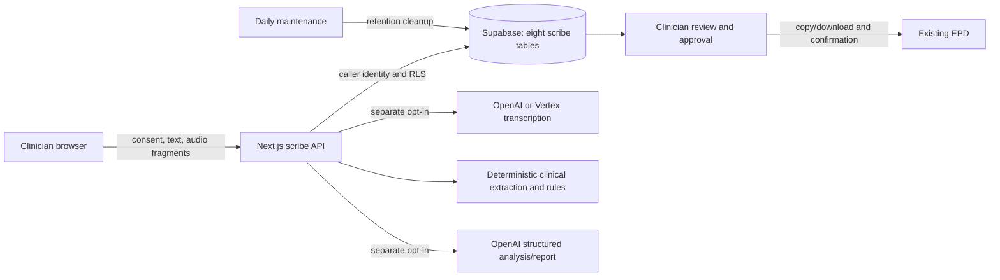

# Careon Scribe — independent implementation audit

**Audit date:** 10 September 2026  
**Disposition:** Engineering acceptance reopened; keep clinical activation gated.  
**Scope:** Current local Careon Scribe implementation, its integration into Careon Pulse, automated tests, synthetic browser workflows, and the actual local PostgreSQL migration.  
**Source baseline:** repository HEAD `d948236e88c0656cc4e1fe628817e3f1b4e82694` plus the pre-existing uncommitted/untracked implementation. HEAD alone does **not** contain the audited scribe module.

## 1. Executive assessment

Careon Scribe has a substantial, coherent implementation. It captures short audio fragments, builds a transcript and structured clinical state, generates discipline-specific draft reports, requires clinician review, supports manual EPD transfer, and applies organization and clinician permissions. The privacy architecture includes useful controls: no application audio storage, owner-bound content access, separate external-processing switches, database retention calculations, and clinician-only assessment sections.

**The current implementation is not ready for use on real consultations.** This conclusion follows from reproduced software defects as well as the already documented activation gates. Passing the existing suites does not resolve the new counterexamples. Ordinary statements can create wrong medication doses, invented symptoms, or another person's medication in the patient's draft. Some concurrency and database paths undermine corrections, deletion, approval, and retention. Browser drafts survive cache clearing, and a microphone permission race can outlive the consultation component.

The most consequential findings are:

| Area | Evidence | Consequence |
|---|---|---|
| Clinical extraction | “sertraline 50 mg en tramadol 100 mg” produces tramadol **50 mg**; normal sleep/appetite becomes pathology | Source-linked drafts can contain facts that were never stated |
| Patient versus family context | A statement about the speaker's mother creates the patient's complaint and current medication | Medication checks and report text concern the wrong person |
| AI evidence and risk text | Mocked model facts with empty/nonexistent citations are accepted; negative suicide-risk wording passes through a scalar field | Structured output and the current risk filter do not enforce the claimed semantic safeguards |
| Administrator deletion | Actual local PostgreSQL returns `DELETE 0`; the supported route still reports successful deletion | A clinician's complete consult can remain after an administrator believes it was removed |
| Corrections and review | Interleaved database writes lose transcript invalidation and overwrite separate note edits | The visible transcript, reviewed edits, and approved report can diverge |
| Terminal states | A cancelled session accepts reinserted transcript/state; `/analyse` can create state without checking status | Erasure is not stable against subsequent or in-flight work |
| Recording and browser storage | Synthetic lifecycle probes retain a clinical draft after cache clearing and leave a microphone track active after late permission resolution | Privacy and data-loss controls have uncovered lifecycle holes |
| Release readiness | Fresh quality gate fails formatting; dependency audit reports four vulnerable packages, including critical Next.js advisories | The earlier “all gates green / zero vulnerabilities” statement is historical |

These are findings about the inspected software. They are **not evidence that a real patient was harmed, that production was compromised, or that the deployed schema exactly matches this local migration**. Detailed entries below distinguish executed reproductions from source-derived race/error paths.

## 2. What the module does

### User workflow

1. An organization administrator records activation evidence, sets retention and external-processing preferences, and authorizes clinicians. The platform provider flag is a separate control.
2. A clinician opens `/scribe`, starts a consult with a short dossier reference, selects language/format, and confirms the displayed consent statement.
3. The workspace captures approximately eight-second 16 kHz mono WAV fragments with one-second overlap, or accepts manually typed conversation text. Demo mode uses a scripted synthetic conversation.
4. The browser sends fragments to a same-origin API. OpenAI or Vertex transcription returns text; the application does not write audio files or Storage objects.
5. Analysis combines transcript content with a structured clinical state. The deterministic fallback extracts facts and recomputes a limited medication-rule set; optional OpenAI analysis augments this workflow. The clinician can correct speakers, transcript text, and individual facts.
6. After recording stops and analysis catches up, the clinician finishes the consult and generates a report in one of eight formats. Machine-filled sections are reviewed; starred assessment/risk sections require clinician input.
7. The approved report can be copied/downloaded for manual transfer to the EPD. The clinician confirms transfer. Transcript/state and the remaining working copy follow their separate retention paths. Tasks remain within the scribe module.
8. Administrators can see minimized colleague metadata, request deletion, or release an approved report to a designated colleague. They are not intended to read colleague transcripts.

### Architecture and data boundaries

The eight tables store sessions, segments, clinical state, notes, tasks, settings revisions, clinician authorizations, and report releases. This is a route section inside Module 1, not a separate deployed service or identity provider. The EPD remains the legal record; automatic EPD writes, task synchronization, full medication surveillance, multilingual translation beyond the offered nl/en path, and native-shell recording are outside the accepted delivery boundary. Their absence is not counted as an implementation bug.

The browser entry uses document navigation because microphone permission policy is attached to the document. The native shell tile is deliberately withheld. Organization enablement chiefly governs starting consults; existing-session access and the two external-processing switches have distinct behavior. Operators should use the explicit provider switch to stop external processing, rather than infer that hiding a tile stops every in-flight operation.

## 3. Audit method and evidence limits

Three independent review tracks examined clinical/AI behavior, backend/data boundaries, and frontend/recording behavior. The main review checked cross-layer contracts, provider request shapes, release configuration, and full-suite results. Findings were reconciled to avoid counting the same race twice.

Evidence labels used in the detailed findings:

- **Executed:** real application functions, browser interactions, or actual PostgreSQL policies/transactions exercised with synthetic data.
- **Mocked provider:** the real analysis code executed with a locally intercepted, deliberately adversarial model response. This proves acceptance of invalid output, not the frequency of actual model hallucinations.
- **Interleaved SQL:** the actual route read/write shapes applied in a controlled order. This demonstrates missing conflict protection without claiming a timed production HTTP exploit.
- **Source/contract review:** a supported path or error path traced through code, sometimes checked against current official provider documentation. Live provider behavior remains unmeasured.

No production settings, patient records, provider accounts, entitlements, or migrations were changed for this audit. No external AI calls or real microphone capture were needed. PostgreSQL tests used fresh disposable databases and removed them afterwards. Browser tests used an explicit local demo environment, an unreachable local Supabase URL, empty service-role credentials, and disabled live AI flags. Application fixes, commits, pushes, and deployment were outside this audit task; only reports/evidence and platform tracking documentation were added or updated.

Production schema application and the earlier 21-check live smoke are recorded in the 7 September handoff. They are **historical evidence**, not tests rerun here. The local code is uncommitted, so neither the current production app revision nor deployed policy parity can be inferred from it. Real acoustic accuracy, physical Safari/iOS/Android behavior, browser permission UI, noisy/overlapping speech, real clinician acceptance, processor contracts, and legal approval remain unverified.

Priority is practical: **P1** means resolve before clinical activation; **P2** means a material workflow, integrity, or operational gap needing a fix and targeted acceptance. The shared dependency entry separately records the upstream advisory's critical severity; a package advisory alone is not proof that a given deployed instance is exploitable.

## 4. Verification results

| Check | Fresh result | Interpretation |
|---|---|---|
| `npm run verify:ci` | **Fails** at Biome: pre-existing formatting in `tsconfig.json` | Full chain does not pass; no source fix applied |
| TypeScript / data hygiene | Pass / pass | Types and tracked-data hygiene baseline pass |
| Scribe server / domain | **93 / 97 pass** | Request-shape and domain baseline, not clinical validation |
| Product / production / assistant / runtime | **1,168 / 423 / 145 / 178 pass** | Existing suites independently rerun after early CI stop |
| Identity / facturatie atomic / EPD atomic | **11 / 21 / 19 pass** | Shared boundary regressions pass |
| Mobile registry / Storage / TGC sync / queue | **79 / 64 / pass / 122 pass** | Remaining functional checks exit 0 |
| Scribe PostgreSQL | **105 pass**, local PostgreSQL 15.19 | Existing database suite passes on actual local migration |
| New clinical probes | **15 counterexamples reproduced**, four local mock responses | No external AI call; invalid software behavior is confirmed |
| New SQL probes | Deletion, approval, activation, consent, sharing, terminal mutation and two concurrency interleavings reproduced | Disposable databases removed; no production SQL |
| New browser probes | Multi-item import, logout draft, cancellation draft and pending text loss reproduced | Separate Chromium contexts in the inert demo environment |
| Recorder/storage harness | Six targeted observations reproduced | Mocked audio/React lifecycle, not physical-device capture |
| Optimized production build | **Pass**, fresh isolated output directory | Built in demo mode with provider flags off |
| Full Playwright suite | **159/159 pass** (14.4m) | 159 tests, one worker; includes desktop/mobile, light/dark/Careon-theme axe, and all 12 scribe flow tests |
| `npm run audit:production` | **Fails: 4 vulnerable packages** | 1 critical, 2 high, 1 moderate; see INT-03 |

An initial attempt to reuse `.next-e2e` hit an old Windows reparse-link `EPERM` error. A fresh nested build directory succeeded. This is a local build-artifact issue, not counted as a scribe runtime defect. Next.js added that temporary output directory to `tsconfig.json`; those audit-generated additions were removed after verification while preserving the user's pre-existing file content.

The conventional suites are valuable but focus heavily on expected examples, shape checks, source assertions, and the demo path. They do not prove clinical semantic accuracy, runtime transaction integrity, or lifecycle safety. In particular, a server test that verifies `diarized_json` is selected still misses the unsupported `prompt` parameter; one-item EPD import tests miss multi-item version conflicts; owner-access tests miss successful-looking zero-row administrator deletion.

## 5. Provider and release findings

### INT-01 — P2: The configured diarization path sends an unsupported parameter

**Evidence:** `src/lib/careon-scribe/transcriptie.server.ts:143–153` constructs `prompt` for every OpenAI transcription model, including `gpt-4o-transcribe-diarize`. A local call to the actual request builder confirms the outgoing fields include `prompt`, `response_format: diarized_json`, and `chunking_strategy: auto`.

OpenAI's current [file transcription documentation](https://developers.openai.com/api/docs/guides/speech-to-text) states that the diarization model does not support prompts. This request contradicts that contract. Expected result when that model is configured: rejected transcription requests and missing-fragment handling. No live rejection was induced in this audit. The default mini-transcription model is a different path and is not implicated by this parameter incompatibility.

**Fix/acceptance:** Use a model-capability-specific field allowlist; omit prompt for diarization. Add a negative request-shape assertion and separately verify a consented synthetic diarization request. Neutral speaker labels also need explicit role mapping; the current adapter maps unrecognized labels to `onbekend`, so diarization is not equivalent to reliable doctor/patient identification.

### INT-02 — P1 activation gate: The Vertex adapter does not enforce its EU-only contract

**Evidence:** `transcriptie.server.ts:76–92` accepts any nonempty configured location, and `:234–235` inserts it into the processing URL. A synthetic configuration with `CAREON_SCRIBE_VERTEX_LOCATION=us-central1` is accepted and builds an endpoint under `us-central1-aiplatform.googleapis.com/.../locations/us-central1/...`. No request was sent.

The default is an EU region, but a default is not an enforced boundary. Google documents region/model-specific [data residency guarantees](https://docs.cloud.google.com/gemini-enterprise-agent-platform/resources/data-residency); the project's D24 proposal expressly limits this adapter to EU processing. A configuration mistake could therefore violate the proposed EU-only processing design once the independent provider gates are enabled.

**Fix/acceptance:** Reject unapproved regions and unsupported model/region combinations before reporting the provider configured. Use an explicit approved region list, not a broad prefix that might include non-EU locations. Test US/global/unknown regions and a valid EU configuration. Confirm the selected model and processor terms during provider acceptance.

### INT-03 — P1 release gate: Shared dependencies now have unresolved security advisories

The fresh dependency audit exits nonzero and reports **four vulnerable packages: one critical, two high, one moderate**. It identifies installed Next.js `16.2.11`, the overridden `sharp` `0.35.3`, plus `js-yaml` and `hono`. These are inherited application dependencies, not introduced by the new scribe logic.

The Next.js maintainer documents a [Windows-hosted remote-code-execution advisory](https://github.com/vercel/next.js/security/advisories/GHSA-p293-qw3h-jr36) and an [AVIF image-optimization advisory](https://github.com/vercel/next.js/security/advisories/GHSA-2xp9-vwfh-vxw4). The Windows condition matters for servers hosted on a Windows filesystem; it does not establish the same exposure on Vercel. AVIF processing has its own input/configuration conditions. No exploit or deployed-image reachability test was attempted.

**Fix/acceptance:** Resolve these through a reviewed dependency update, including the explicit sharp override, then repeat the dependency audit and relevant application/build/browser gates. Do not apply `npm audit fix --force` blindly. Verify deployment-specific exposure and shipped versions. The old “zero vulnerabilities” report is not current evidence.

### INT-04 — P2: Scribe database regressions are absent from the CI database job

**Evidence:** `.github/workflows/ci.yml:30–35` executes authorization, facturatie, and EPD PostgreSQL suites, but not `src/scripts/verify-scribe-postgres.py`. `package.json`'s `verify:scribe` executes TypeScript server/domain checks only. The 105-check scribe database suite was run manually during this audit and passed; that does not give it future CI protection.

**Fix/acceptance:** Wire the scribe PostgreSQL suite into the database job and add the negative/race cases in this report. Demonstrate that a deliberately broken owner/lifecycle/approval invariant makes CI fail. Static SQL-text checks cannot substitute for the database behavior tests.

### INT-05 — P2: Delivery tracking overstates completeness and deployment certainty

At audit start, G20 said every remaining item was an owner/contract/acceptance input rather than engineering work. The reproduced defects invalidate that conclusion. The entire new module is still untracked/uncommitted in the inspected working tree, while the schema is documented as already applied. A local feature demonstration therefore does not establish that a matching version is deployed or reproducible from HEAD.

The fresh `verify:ci` stops at a pre-existing Biome formatting failure in `tsconfig.json`. All subsequent checks were run independently to avoid mistaking that early stop for a full result; the dependency audit also fails. These facts need to be carried into release acceptance.

There are smaller documentation contradictions worth correcting: G20's acceptance text excludes an org_admin without a clinician grant, while the specified/current predicate intentionally permits administrators; “no name” validation is not guaranteed by the permissive letter/space dossier-reference pattern; and consent/template and SQL-activation claims are stronger than implementation. Resolve these as explicit product contracts and tests, rather than silently weakening or expanding permissions.

**Fix/acceptance:** Reopen engineering acceptance, preserve D24 as Proposed, commit a reviewed complete implementation when authorized, verify deployed app/schema parity, and attach fresh passing gates to that exact revision. The platform tracking documents are updated by this audit; application corrections remain pending.

## 6. Remediation sequence and release acceptance

| Order | Work | Required evidence |
|---|---|---|
| 1 | Correct clinical assertion handling, dose pairing, family context, language fallback, source validation and machine-generated risk-text filtering | Clinician-reviewed positive/negative paired fixtures; all counterexamples below rejected or represented accurately; legitimate clinician-authored assessments remain possible |
| 2 | Make transcript correction, analysis completion, note edits/approval, cancellation/transfer, deletion and sharing transactionally consistent | Real PostgreSQL and route tests with competing writes, terminal requests, no-row deletes and two-recipient races |
| 3 | Repair draft cleanup, microphone cancellation, pending audio/gap accounting and EPD multi-item import | Browser/hook tests for logout/account switch/cancel, late permission, offline queues, restart and multi-fact input |
| 4 | Enforce provider configuration contracts and observable retention cleanup; repair dependencies and CI wiring | Negative provider configuration tests, synthetic provider acceptance, cleanup-failure alert, clean dependency audit, full gates |
| 5 | Complete existing owner/processor/DPIA/consent gates and controlled clinical/device acceptance | Explicit D24 decision, documented processing agreements, accepted consent/retention choices, audited end-to-end clinician pilot |

Do not treat a formatting repair or an increase in assertion counts as closing the findings. Each item needs its stated behavioral regression, and the final approval must bind to the exact content/revision reviewed. No estimate is supplied because several changes share state/transaction design and should be scoped together before assigning delivery dates.

### Acceptance matrix currently missing or insufficient

- Multi-drug sentences with distinct doses, decimal commas/dots, confirmed versus proposed changes, cessation, negatives, normal findings, questions, family history, and English fallback.
- Model output with empty, fabricated, wrong-context, and misleading valid-looking citations; machine-generated risk polarity in every text field and final report section, while preserving explicit clinician-authored assessments.
- Real caller routes for admin deletion, stale note saves, transcript correction during analysis, cancellation during generation, and post-transfer mutation attempts.
- Multi-item EPD import with one coherent revision, explicit partial-failure behavior, and no loss of clinician corrections.
- Long/noisy consultations, repeated start/stop, permission denial/late permission, pause/unload, offline recovery, queue saturation, and unpersisted gap acknowledgement.
- Logout, account switching, cancellation and deletion with live text drafts present in every browser storage mechanism.
- Production app/schema parity, activated provider contract checks, cleanup monitoring, and representative signed/physical-device acceptance where those channels will be supported.

## 7. Detailed findings and reproducibility

**35 distinct actionable findings: 17 P1, 17 P2, 1 P3.** UI-09 is consolidated into SEC-03. Priority measures remediation urgency; some entries are configuration or release gaps rather than currently exercised production defects. P3 denotes a lower-priority clarity issue.

| ID | Priority | Finding |
|---|---|---|
| INT-01 | P2 | The configured diarization path sends an unsupported parameter |
| INT-02 | P1 | The Vertex adapter does not enforce its EU-only contract |
| INT-03 | P1 | Shared dependencies now have unresolved security advisories |
| INT-04 | P2 | Scribe database regressions are absent from the CI database job |
| INT-05 | P2 | Delivery tracking overstates completeness and deployment certainty |
| C-01 | P1 | Medication doses are assigned per clause, not per medicine |
| C-02 | P1 | Normal findings become pathological symptoms |
| C-03 | P1 | Questions are promoted into confirmed facts and future actions |
| C-04 | P1 | Family members' conditions and medicines become the patient's |
| C-05 | P1 | Advertised English consultation language is unsafe in the fallback path |
| C-06 | P2 | The last fragment is marked analyzed before its assigned speaker/correction has been used |
| C-07 | P1 | Model facts accept empty and nonexistent source references |
| C-08 | P1 | The no-risk-polarity invariant can be bypassed through scalar fields |
| C-09 | P2 | A stopped medicine remains simultaneously current |
| SEC-01 | P1 | Administrator deletion reports success while retaining the entire consult |
| SEC-02 | P1 | A late analysis response can erase a clinician's transcript-correction invalidation |
| SEC-03 | P1 | Concurrent report edits silently overwrite each other |
| SEC-04 | P2 | Persisted consent text is not the text read aloud |
| SEC-05 | P1 | SQL accepts missing DPIA/consent evidence that the product claims to require |
| SEC-06 | P2 | Direct authenticated note approval can finalize an empty report |
| SEC-07 | P1 | Terminal consults remain mutable and their purged state can be recreated |
| SEC-08 | P2 | Concurrent releases can give the same consult to more than one colleague |
| SEC-09 | P2 | Frozen consent provenance is caller-supplied and not bound to a settings revision |
| SEC-10 | P2 | Retention cleanup failure is returned as successful maintenance |
| UI-01 | P1 | clinical manual drafts survive logout, account-cache clearing and consent cancellation |
| UI-02 | P1 | a microphone permission result can start recording after the component was unmounted |
| UI-03 | P1 | failed gap persistence does not block completion or the report approval gate |
| UI-04 | P2 | EPD-list import saves only the first recognized fact |
| UI-05 | P2 | manual text typed while saving is silently discarded; completion also discards an unsent draft |
| UI-06 | P2 | pausing bypasses unload protection for the final buffered audio |
| UI-07 | P2 | stop/start resets transcript timestamps within the same consult |
| UI-08 | P2 | the record control ignores the organization's transcription switch |
| UI-10 | P2 | mobile consult list loses deletion, release/revocation and retention controls |
| UI-11 | P2 | section copying bypasses the report-approval/export route and overstates transfer readiness |
| UI-12 | P3 | adding/retracting one item falsely represents completion of the current EPD list |

The following appendices retain exact source locations, synthetic inputs/results, practical impact, and repair guidance for each review track. Line numbers refer to the inspected working tree. An evidence bundle beside this report retains source hashes, synthetic probes and captured results; no patient material or credentials are included.

## Appendix A — Clinical and AI behavior

### C-01 — P1: Medication doses are assigned per clause, not per medicine

- **Reproduced:** `Ik gebruik sertraline 50 mg en tramadol 100 mg.` produces sertraline **50 mg** and tramadol **50 mg**. The SOAP draft literally says `Medicatie: sertraline 50 mg (huidig) en tramadol 50 mg (huidig). (§1)`.
- **Related omission:** `Ik gebruik lorazepam 0,5 mg.` yields lorazepam with `dosering: null`; the dose disappears from the report. The common Dutch decimal comma is treated as a clause separator.
- **Cause/evidence:** `src/lib/careon-scribe/deterministisch.ts:59-64` splits on commas and periods. `:419-422` reads the first dose. `:500-508` calculates that one dose for the entire clause, and `:531-551` reuses it for every recognized medicine.
- **Impact:** A syntactically valid, source-linked draft contains a dose that was never said for that medicine. The dosing inconsistency check does not repair it because the wrong value is already normalized into the single source record. Decimal prescriptions also lose information silently.
- **Fix:** Tokenize decimal quantities before sentence splitting; pair each medicine span with its own dose/unit/frequency and use unknown plus a visible clarification when ambiguous. Test multiple medicines, reversed dose order, decimal comma/dot, units, dose changes and conditional prescriptions.

### C-02 — P1: Normal findings become pathological symptoms

- **Reproduced:** `Ik slaap goed en mijn eetlust is normaal.` yields `hoofdklacht: slaapproblemen`, symptoms `slaapproblemen` and `verminderde eetlust`. The SOAP text twice asserts sleep problems and asserts reduced appetite.
- **Cause/evidence:** `deterministisch.ts:123-132` maps any sleep prefix to sleep problems and any appetite mention (or weight gain/loss) to reduced appetite. `:650-660` applies the labels after only a limited `geen|niet|nooit` check (`:103-114`); no positive/normal finding check exists.
- **Impact:** A reassuring statement becomes a complaint, affecting both the evolving state and the eventual draft. This contradicts the documented conservative extraction principle. This is confirmed without an AI provider.
- **Fix:** Require an explicit symptom assertion; keep normal findings as normal/negative assertions rather than mapping topic occurrence to disease. Add paired positive, normal and negative examples for every lexicon category and retain the exact source span.

### C-03 — P1: Questions are promoted into confirmed facts and future actions

- **Reproduced:** `Bent u allergisch voor penicilline?` (speaker `arts`) produces `{tekst: penicilline, aard: allergie}` and the report `Allergieën: penicilline (allergie). (§1)` before any answer.
- **Other reproductions:** `Bent u sinds drie maanden ernstig somber?` produces duration `drie maanden` and severity `ernstig`. `Heeft u eerder bloedonderzoek gehad?` becomes a lab action and the plan section, despite being a question about history.
- **Cause/evidence:** `deterministisch.ts:629` computes `isUitvraag`, but only medication extraction uses it (`:687`). Duration/severity run for all speakers (`:635-645`); allergy extraction is unconditional (`:688`, implementation `:559-581`); any doctor segment with an action keyword creates a plan/task (`:717-727`).
- **Impact:** An unanswered allergy screening question creates an active allergy and can drive a deterministic medication warning. Unconfirmed severity/duration and historical questions are presented as clinical output or tasks. Existing symptom-question filtering is not consistently applied to the other categories.
- **Fix:** Use one assertion/context classification shared by all extractors (question, historical discussion, confirmed answer, proposal, negated plan). Questions can mark a topic discussed, but must not establish a positive clinical fact. Link short answers to questions explicitly or leave the fact pending confirmation.

### C-04 — P1: Family members' conditions and medicines become the patient's

- **Reproduced:** `Mijn moeder is depressief en gebruikt sertraline 100 mg.` (patient speaking) produces the patient's chief complaint `somberheid` and current sertraline 100 mg. The SOAP draft says `Cliënt meldt somberheid` and lists the medicine as current.
- **Cause/evidence:** `deterministisch.ts:627-628` treats patient speech as patient facts. `:650-660` extracts symptoms, `:687` medicines, and only subsequently `:691` also records family history. `extraheerMedicatie` (`:500-556`) has no subject/experiencer gate.
- **Impact:** The family-history section does not prevent the same statement polluting the patient's active medication and complaints. Downstream drug checks and report text are therefore based on the wrong person.
- **Fix:** Preserve who each statement concerns; extract family reports only into family history unless a separate clause explicitly describes the patient. Include negated, hypothetical and third-party medication examples in the clinical acceptance corpus.

### C-05 — P1: Advertised English consultation language is unsafe in the fallback path

- **Reproduced:** `I do not take tramadol.` yields current tramadol; the English negation is lost. `I am allergic to amoxicillin. I have felt depressed for three months.` yields no allergy, complaint or duration and the report says the subject was not discussed.
- **Cause/evidence:** `src/lib/careon-scribe/types.ts:40-41` advertises `nl` and `en`. `agent.server.ts:448-451` calls the same deterministic function with no language parameter; the extractor `deterministisch.ts:617` has no language parameter at all. Its negation, allergy, symptom and duration vocabulary is Dutch (`:103-114`, `:123-139`, `:235-244`, `:308-310`).
- **Impact:** Every English consult without external AI enabled, or after an AI failure, silently falls back to logic that can invert medication statements and omit allergy/history. The generic deterministic badge does not communicate unsupported language. This is especially relevant because deterministic operation is the default and provider-error fallback.
- **Fix:** Implement and clinically test an English parser, or gate unsupported language in deterministic mode and visibly require manual structured completion. Never claim `not discussed` when text exists but the parser does not understand it. Root is separately reporting that Vertex transcription also ignores the language setting and always prompts for Dutch.

### C-06 — P2: The last fragment is marked analyzed before its assigned speaker/correction has been used

- **Reproduced:** A live segment with speaker `onbekend` and text `Ik vraag bloedonderzoek aan.` produces a speaker assignment to `arts`, but the same round's `plan` and `acties` are empty. Its SOAP plan says not discussed.
- **Cause/evidence:** `deterministisch.ts:1482` extracts state first; `:1483-1501` then computes speaker labels and text corrections. It returns the earlier state without rerunning extraction (`:1502`). `scribe.server.ts:1074-1092` persists those labels/corrections, then advances `laatste_segment` and clears `verouderd` (`:1095-1109`). The next call with no new segment returns immediately (`:1040-1056`).
- **Impact:** A later round may repair previous fragments, but the final fragment can stay omitted or incorrectly extracted when the clinician finishes immediately. The default OpenAI transcriber returns `onbekend` for plain text, so this is a normal path, not only a malformed-input edge case. ASR correction ordering shares this issue.
- **Fix:** Apply predicted speaker assignments and safe corrections to an in-memory effective transcript before extracting, then persist the state corresponding to that exact effective transcript atomically. Alternatively explicitly invalidate/reanalyze affected segments, including when no new audio arrives. Test a final doctor plan and a final corrected medicine with no following fragment.

### C-07 — P1: Model facts accept empty and nonexistent source references

- **Reproduced with a mocked model response:** The only input segment is `§1 Ik heb hoofdpijn.`. The model returns current `lithium 900 mg` with `bron: []`, `[0]`, or `[999]`. All three responses are accepted with `bron: ai`; the deterministic report carries lithium 900 mg and either no citation, `§0`, or `§999`.
- **Cause/evidence:** `src/lib/careon-scribe/types.ts:459-464` accepts empty arrays and zero/any nonnegative integer. `klinische-staat.ts:143-146` validates only that shape. `agent.server.ts:500-512` accepts the model state and merges it; the available segment-number set is used for speaker/correction records, not facts. `bouwVerslagDeterministisch` does not reconcile fact sources with its segment argument (`deterministisch.ts:1395-1434`).
- **Impact:** The claimed per-fact evidence boundary is not enforced. Unsupported medication, allergy, plan, and clinician-overweging text can acquire the appearance of evidence and reach review. The report model's separate valid-source filter does not fix state contamination; its fallback retains the contaminated deterministic basis.
- **Fix:** Validate newly model-generated fact references against actual permitted transcript segments and reject empty references for such facts. Keep clinician-entered `doorBehandelaar` facts as a separately trusted, explicit exception. Validate fact/source semantic support for important medication facts, and require actual clinician-source speech for `overwegingen`. Test nonexistent, empty, cross-context and mismatched valid citations. The mock demonstrates acceptance, not the frequency of real-model hallucinations.

### C-08 — P1: The no-risk-polarity invariant can be bypassed through scalar fields

- **Reproduced through the real analysis function with a mocked model response:** A valid state with `hoofdklacht: Geen suïcidaliteit` survives `analyseerSegmenten` with source `ai`; the SOAP draft says `Cliënt meldt Geen suïcidaliteit.` in the machine-filled Subjectief section.
- **Cause/evidence:** `deterministisch.ts:1339-1347` lists only seven array fields for risk normalization. `:1357-1381` normalizes those arrays, `psychisch` and `samenvatting`, but leaves `hoofdklacht`, `duur`, `beloop`, `ernst`, several other text arrays and action descriptions untouched. Report generation consumes the scalar chief complaint (`:1204-1224`, `:1395-1434`). `agent.server.ts:509-511` calls this incomplete normalization before accepting the state.
- **Impact:** The documented S10 invariant is not a hard invariant: an unreviewed machine-generated section can assert negative suicide risk. Protected starred review sections do remain empty, but that does not prevent the same claim in another section.
- **Fix:** Apply risk-polarity validation to all externally generated text that can reach the UI or report, including scalar fields, and at the final report boundary. Prefer typed risk-discussion fields instead of arbitrary strings for these categories. Keep clinician-authored risk assessment distinct so intentional reviewed assessment is not erased.

### C-09 — P2: A stopped medicine remains simultaneously current

- **Reproduced:** Segment 1 `Ik gebruik sertraline 50 mg.` followed by segment 2 `Ik ben gestopt met sertraline.` yields active rows for both current sertraline 50 mg and stopped sertraline. The report prints both statuses, with neither marked retracted.
- **Cause/evidence:** `deterministisch.ts:465-483` treats confirmed usage statuses as distinct rows; a stop does not supersede the current record. `klinische-staat.ts:446-447` merges by `naam|gebruik`, so the inconsistency persists across rounds; `:604` makes medication additive. `medicatie-veiligheid.ts:451-454` still treats the unretracted current row as relevant.
- **Impact:** The clinician gets a contradictory medication list and potentially persistent interaction alarms after cessation. Preserving history is appropriate, but historical use must be distinguished from active use. This reproduction concerns automatic deterministic reconciliation; the clinician can currently repair it manually.
- **Fix:** Preserve the earlier record as history/retracted and express explicit transitions with source timestamps. If the timing is ambiguous, surface a reconciliation question rather than maintaining two definitive active assertions. Distinguish proposed changes from actual cessation.

### Positive controls and limits

- Provider calls require the platform flag plus organisation AI permission; deterministic operation and provider-error fallback are real, not stubs.
- Strict structured-output schemas constrain model shape; source lists and clinically meaningful fields still need semantic validation.
- The system recomputes its own deterministic medication warnings (`rondStaatAf`) and does not trust a model's claim that a warning came from a curated rule.
- Starred clinical assessment sections are not generated by the model and are initialized with empty review text; the cited narrative in the draft is kept separate. Security agent is separately auditing whether database approval enforces the complete required section set.
- Most risk-text fields are normalized to discussion-only language. C-08 describes specific holes, not absence of the control.
- Prior allergy/medicine facts are preserved across omissions. This is helpful for recall but also makes initial false positives persistent until explicit correction.
- The live provider has not been called. No measurement was made of speech word error, speaker diarization accuracy, accents, environmental noise, or real model hallucination rate. The synthetic acceptance probes target falsifiable software invariants.
- Rule catalog coverage/medical correctness has not been clinically certified. It intentionally covers a limited set of interactions and is not a replacement for a current medication knowledge base, maximum-dose engine or clinical review.
- The test corpus should add these counterexamples before release, then expand to clinician-reviewed golden consultations across the offered disciplines and both supported languages. Passing the existing tests does not override these directly reproduced counterexamples.

## Appendix B — Backend, authorization and retention

### SEC-01 — P1: Administrator deletion reports success while retaining the entire consult

**Locations:** `src/app/api/careon/scribe/sessies/[sessieId]/route.ts:404` and `:425`; `src/lib/careon-scribe/scribe.server.ts:416`; `supabase/migrations/20260907120000_careon_scribe.sql:1111` and `:1144`.

The route correctly reads colleague metadata through the service role, then deletes under the administrator's caller JWT. That administrator cannot SELECT the colleague's session under RLS. PostgreSQL requires SELECT visibility for this filtered DELETE (`id` and `org_id` are in its WHERE clause). The DELETE policy's administrator branch does not restore that visibility. The helper requests `return=minimal`, never checks affected rows, and the route unconditionally emits `verwijderd: true` and an audit event claiming deletion.

**Reproduction:** Create a consult owned by an authorized clinician. As a different org_admin, execute the same filtered DELETE. Actual result: `DELETE 0`. The owner still reads one session afterward. No ownership grant or report release was present.

**Impact:** Offboarding/privacy deletion fails silently; transcript, clinical state, report, and tasks remain. The application and audit log falsely report completion. Applies to ordinary supported admin deletion, without malicious input.

**Fix direction:** Perform a narrowly scoped authorized server-side deletion that can see the row, or design a privileged operation consistent with the project's ban on public authenticated definer RPCs. Keep administrator content reads blocked. Require returned ID/affected-row evidence before emitting success; test the real admin route end to end.

### SEC-02 — P1: A late analysis response can erase a clinician's transcript-correction invalidation

**Locations:** `src/app/api/careon/scribe/sessies/[sessieId]/segmenten/[volgnummer]/route.ts:95`, `:100`, `:114`; `src/lib/careon-scribe/scribe.server.ts:1096`–`:1106`.

Analysis protects its state update with `versie = previousVersion`. Transcript correction updates the segment, then sets `verouderd: true` and rewinds `laatste_segment`, but neither increments that version nor uses an atomic lock with the segment write. An analysis request that already read the old text retains a valid version predicate. It can therefore overwrite the state with old clinical facts, clear `verouderd`, and advance `laatste_segment` past the correction.

**Reproduction:** Analysis reads state v1. Clinician correction marks the same v1 stale and rewinds to 0. The earlier analysis writes with WHERE versie=1, setting v2, last segment 2, stale=false. PostgreSQL accepts it; captured result is `2|2|f`. This is a deterministic interleaving of the actual route writes on an active synthetic consult.

**Impact:** Corrected dose/allergy/negation text remains visible in the transcript while generated state/report uses the previous value. The report-generation freshness guard now accepts it as current. This race arises during normal auto-analysis and correction.

**Fix direction:** Atomically correct transcript and invalidate/increment state revision, and make every analysis result bind to a transcript revision. A lost CAS must retry from fresh transcript/state. Include an interleaved correction/model-completion regression.

### SEC-03 — P1: Concurrent report edits silently overwrite each other

**Locations:** `src/app/api/careon/scribe/sessies/[sessieId]/notitie/[notitieId]/route.ts:84`, `:150`–`:158`; UI `src/app/(main)/scribe/_components/verslag-review.tsx:515`–`:523`.

Each note PATCH reads the complete section array, edits one or more entries, then writes the entire array with only note ID and org filters. There is no revision/ETag/updated_at predicate. Note `versie` identifies a document version and never increments for edits. The UI launches an asynchronous save on blur without awaiting it before separate section/approval actions, so normal rapid interaction can create overlapping requests as well as multiple tabs.

**Reproduction:** Two handlers read the same original note. Request A changes Subjectief; request B changes Objectief from its older copy. Apply A then B with the route's predicates. Both writes succeed; A's correction disappears while B's remains. The captured probe shows original Subjectief + corrected Objectief.

**Impact:** Clinician changes or approval states disappear without conflict feedback; an older clinical statement can be finalized. Whole-document immutability after final approval does not protect intermediate edits.

**Fix direction:** Use an edit revision and conditional atomic updates, or an RPC applying a section mutation under a note lock. Serialize pending UI saves and bind final approval to the exact reviewed revision.

### SEC-04 — P2: Persisted consent text is not the text read aloud

**Locations:** `src/app/api/careon/scribe/sessies/route.ts:248`; `src/app/(main)/scribe/_components/nieuw-consult-form.tsx:88`; `src/data/careon/careon-scribe.ts:149`–`:154`.

The form uses `vulConsenttekstIn(settings.consenttekst, settings)` to display actual retention days. Session creation persists the raw `instellingen.consenttekst`, containing `{transcriptRetentieDagen}` (and any configured `{notitieRetentieDagen}`), rather than applying the same rendering helper.

**Reproduction:** Start a consult with the default consent template and a 30-day transcript term. The patient sees/hears “30 dagen”; the frozen consent row contains “{transcriptRetentieDagen} dagen”. Confirmed by source tracing; no live consult was created.

**Impact:** S13's promised literal consent evidence is inaccurate and loses the presented retention wording. Stored revision may allow reconstruction, but is not the literal snapshot claimed by the product.

**Fix direction:** Populate placeholders on the server from the accepted settings revision before insert; compare stored text with the displayed resolved text in a server-route regression.

### SEC-05 — P1 activation gate: SQL accepts missing DPIA/consent evidence that the product claims to require

**Locations:** `supabase/migrations/20260907120000_careon_scribe.sql:381`–`:383`; `src/lib/careon-scribe/types.ts:643`–`:653`; `src/app/api/careon/scribe/instellingen/route.ts` activation check.

The SQL predicate only checks ingeschakeld, non-NULL `dpiaVastgesteldOp`, and the processor-agreement boolean. It does not require a nonempty/valid DPIA date, DPIA owner, or consent-text approval date. The settings table grants authenticated administrators INSERT and only weakly validates JSON shape. Documentation and route comments explicitly claim parity with the full TypeScript activation checklist.

**Reproduction:** Under an org_admin JWT insert state `{"ingeschakeld":true,"dpiaVastgesteldOp":"","verwerkersovereenkomstBevestigd":true}`. Actual `app.scribe_ingeschakeld(org)` is true, and an authorized clinician can INSERT an active consult. DPIA owner and consent approval are absent.

**Impact:** Direct authenticated PostgREST can bypass the per-organization clinical-data activation preconditions. This does **not** bypass `CAREON_SCRIBE_LIVE` or enable a provider by itself, and production is documented as inactive; classify as a blocker before activation rather than a claim of current live disclosure.

**Fix direction:** Validate complete activation evidence in database settings writes/predicate, including safe date parsing and nonempty owner, sharing a documented contract with TypeScript. Add direct-PostgREST negative tests for every missing/malformed prerequisite.

### SEC-06 — P2: Direct authenticated note approval can finalize an empty report

**Locations:** `supabase/migrations/20260907120000_careon_scribe.sql:485`, `:959`–`:974`, `:1333`.

The database section guard permits empty arrays. The approval RPC counts unapproved entries and empty required clinician sections; both counts are zero for `[]`. Since the authenticated owner can insert a concept note directly (default secties=`[]`), the RPC approves that empty document and advances its finished session to approved. Required assessment sections are taken from caller-supplied flags, not the authoritative format definition. The same RPC also has no transcript-gap acknowledgement argument, so N22's acknowledgement lives only in the HTTP route.

**Reproduction:** Create an authorized owner session, finish it, insert a concept note without providing secties, then call `careon_scribe_notitie_goedkeuren`. Actual note status and session status both become `goedgekeurd`.

**Impact:** The claimed DB-enforced clinical approval contract is weaker than the supported API; an owner or alternative client can produce/export a formally approved empty or structurally incomplete report. This is owner-content integrity, not access to a colleague's data.

**Fix direction:** Validate the exact canonical section set for the format, required clinician flags, nonempty entries, parent lifecycle, and any required gap acknowledgement within the authoritative approval transaction. Add empty/omitted/relabelled-section negative tests.

### SEC-07 — P1: Terminal consults remain mutable and their purged state can be recreated

**Locations:** `src/app/api/careon/scribe/sessies/[sessieId]/analyse/route.ts:34`–`:40`; `src/lib/careon-scribe/scribe.server.ts:993`–`:1004`, `:1036`, `:1102`; `supabase/migrations/20260907120000_careon_scribe.sql:1172`, `:1221`, `:1333`.

The analysis route checks ownership but not session status. Its helper creates a missing clinical-state row. After cancellation/transfer purges the state, calling analysis therefore recreates it even without a race. Child insert/update policies only check owner/session/org and never check the lifecycle. An in-flight analysis that loses its state row to cancellation retries and calls that same creation helper. A delayed note-generation response can likewise insert a concept after the session was cancelled. Segment correction also lacks a terminal-state check.

**Reproduction:** Cancel a synthetic consult through the actual status RPC. Under the same owner JWT, insert a clinical state and a transcript segment. Both succeed; captured result `geannuleerd|0|1|1` means cancelled session, counter=0, one transcript row, one state row. The segment was deliberately #901, proving direct writes also bypass the RPC's 900-segment/counter invariant. For the normal HTTP path, call /analyse after cancellation: source tracing shows an empty state will be recreated through `zorgVoorStaatRij` (no provider needed).

**Impact:** A “transcript and state erased” terminal state is not stable; late requests can persist new content after withdrawal/transfer or modify the clinical basis of an approved document. Ownership RLS remains intact, but lifecycle/retention promises are not enforced at the final write.

**Fix direction:** Guard each content mutation against the current parent state in a serialized database operation. Cancellation/transfer and pending content writes must lock the same session row, so no later result can restore purged content. Add terminal HTTP tests and in-flight cancellation/write interleavings.

### SEC-08 — P2: Concurrent releases can give the same consult to more than one colleague

**Locations:** `src/app/api/careon/scribe/sessies/[sessieId]/vrijgave/route.ts:132`–`:155`; `supabase/migrations/20260907120000_careon_scribe.sql:297`.

The one-recipient rule is a separate GET-before-POST preflight. The unique key is `(sessie_id, aan_user_id)`, which prevents duplicate releases to the same person but permits multiple different recipients. Two administrators/tabs can both observe no release and then insert different authorized colleagues. Both receive approved-report access.

**Reproduction:** Independent synthetic service-role inserts for the same session to two distinct authorized colleagues both succeed. Captured count=2. Route-level concurrent preflight is not timed in this test; its interleaving follows directly from the two awaited operations and the demonstrated DB constraint.

**Impact:** Violates the explicit “one designated colleague” sharing boundary. It does not release the transcript or permit arbitrary nonmembers.

**Fix direction:** Enforce a unique active release on `sessie_id` (existing design deletes on revocation), or use an atomic session-locked release operation. Return conflict for the second concurrent recipient and test that race.

### SEC-09 — P2: Frozen consent provenance is caller-supplied and not bound to a settings revision

**Locations:** `supabase/migrations/20260907120000_careon_scribe.sql:1123`–`:1133`; session table consent checks near `:120`.

The insert policy requires a recent confirmation timestamp and non-NULL consent text/revision, but never checks that the revision exists, is current, belongs to the organization, or matches the approved consent text. Freeze triggers only make those supplied values immutable afterward.

**Reproduction:** The targeted test inserts consent revision=999999 and text “invented consent” although the sole settings revision is 1. It succeeds under an ordinary authorized clinician JWT.

**Impact:** An alternative client can create immutable yet invented evidence of what was agreed. The normal UI/API tries to protect revision freshness, but the database contract advertised as the direct-PostgREST boundary does not.

**Fix direction:** Resolve and freeze consent from the accepted org settings revision within an atomic creation operation/trigger; reject stale revision and compare/render the canonical text. This is distinct from SEC-04, which affects ordinary supported creation even with honest callers.

### SEC-10 — P2 operations: Retention cleanup failure is returned as successful maintenance

**Locations:** `src/app/api/internal/maintenance/route.ts:150`–`:169`, `:184`–`:186`; `vercel.json:7`.

Scribe prune is best-effort. A failed/non-2xx prune logs an error and leaves `scribeOpgeruimd=null`; the endpoint still returns HTTP 200 with `status:"completed"`. The daily cron therefore appears successful even when no Scribe expiry processing occurred. Failure is discoverable in logs/audit/payload (`scribe:null`) but needs an explicit monitor that examines it.

**Impact:** The documented “daily cleanup, at most 24 hours after expiry” guarantee has no demonstrated failure alert/retry path. Do not claim a production cleanup failure occurred; this is an error-path observability defect by inspection.

**Fix direction:** Return/monitor a partial-failure state, alert on failed Scribe pruning, and implement bounded retries or a later catch-up schedule. Prove the actual deployed cron and alert in staging before activation.

### Strengths verified

- All eight Scribe tables enable RLS, revoke anon, and carry restrictive active-account policies.
- Content access is owner-bound in both USING and WITH CHECK with parent organization/owner validation. Revoked membership/authorization and superadmins without membership are covered by the existing 105-check suite.
- Admin metadata is fetched through an explicit service-role column list omitting dossier reference and consult type; ordinary admin JWT reads cannot recover those protected columns.
- Public authenticated operations are security invoker, preserve RLS, and pin initial note/session statuses. Status/retention freeze triggers block ordinary direct changes; cleanup is restricted to service_role.
- Status changes calculate retention in the database; happy-path cancellation/transfer purge transcript and state synchronously; scheduled pruning is implemented.
- Released recipients can read only approved notes, not transcript/state/tasks; recipient revocation is enforced by the role predicate. Self-release is checked both in route and SQL.
- Fragment RPC serializes on session row, assigns sequence numbers, enforces cap, and returns prior rows for a repeated fragment ID.
- Existing data-flow code stores no audio files or Storage objects; provider regime remains separately opt-in and off by default. No provider or microphone acceptance is implied by these backend checks.

### Limits and intentional gates

- D24 is proposed; DPIA, provider DPA/ZDR, consent approval and owner acceptance remain rollout gates. The audit did not activate anything.
- No production SQL/catalog drift inspection or real caller HTTP path was performed here. The tests validate the current local migration, not that it exactly matches deployed policies.
- No production medical data, actual healthcare advice, or patient conversation was used. Synthetic strings demonstrate data integrity without judging medication correctness.
- The module switch intentionally blocks new consult creation; UI text says so. Existing-session access when that switch is off was not counted as a bug. Independent external-processing switches must be disabled to stop provider work.
- Existing approved reports intentionally remain until their session retention expires after cancellation; their mere retention was not counted as a defect because current S15 separates transcript/state purge from session/report cleanup.
- Concurrent model spend, long-fragment behavior, quotas, media handling, and clinical extraction safety are covered by sibling audit tracks; do not infer acceptance from this security review.

## Appendix C — Browser, recorder and workflow

### UI-01 — P1: clinical manual drafts survive logout, account-cache clearing and consent cancellation

**Sources:** `src/app/(main)/scribe/_components/handmatige-invoer.tsx:30–55,79–81`; `src/lib/careon-scribe/storage.client.ts:294–299`; `src/lib/careon-auth.ts:154–165`; `src/lib/careon-tenant/cache-owner.client.ts:75`; `src/app/(main)/scribe/_components/consult-werkruimte.tsx:381–386`.

Typing any manual transcript content immediately writes it into `sessionStorage` under `careon-scribe-concept-<sessieId>`. The logout and account-switch cleanup paths call `clearScribeState`, which only removes the localStorage demo cache. It never removes the sessionStorage drafts. Cancellation similarly does not call `wisHandmatigConcept`; only the `afgerond` branch does. Thus the module's explicit claim that transcript content is cleared on logout/consent withdrawal is false for unsent text. SessionStorage survives logout within the same tab.

**Reproduction:** type synthetic manual text without submitting it, log out, inspect the draft key in the same tab. Separately type a draft and cancel the consult. The draft remains in both cases. The standalone source-function harness outputs `clinicalDraftCleared:false` after `clearScribeState()` while the demo cache is correctly removed.

**Impact:** residual special-category content on a shared workstation after the clinical session ends or consent is withdrawn. This is browser storage residue; it does not by itself establish a server RLS bypass or automatic visibility in another clinician's normal UI.

**Fix:** centralize draft-key handling in a reusable client storage module. Wipe all scribe draft keys on logout/account or tenant change; wipe the relevant draft on deletion/cancellation/transfer; include pending requests so a late callback cannot recreate wiped data. Keep synthetic regression coverage for both browser stores and the consent-withdrawal path.

### UI-02 — P1: a microphone permission result can start recording after the component was unmounted

**Sources:** `src/lib/careon-scribe/opname.client.ts:435–480,550–560`; logout uses soft navigation in `src/app/(admin)/admin/_components/admin-uitloggen.tsx:35`.

`start()` awaits `getUserMedia()` without a mounted/generation/cancellation guard. Cleanup only stops streams already stored in `streamRef`. If the component unmounts while permission is pending, cleanup sees no stream. When permission subsequently resolves, the abandoned callback creates an AudioContext and processor, attaches the stream and sets recording on; no future effect cleanup is registered for that stream. A soft unmount, including a confirmed logout, is the relevant boundary. An ordinary hard document destruction may cancel the old realm, so the finding must not be described as proven across every type of navigation.

**Synthetic reproduction:** call `start()`, hold the media promise, execute all effect cleanups, resolve media permission. Actual hook output: `trackStopped:false`, expected `true`. If a processor receives audio after that, the closure can continue queueing fragments for the old session. Server authorization still protects accepted writes after logout, but the local microphone should have stopped.

**Fix:** use a lifecycle generation token, invalidate it on stop/unmount, and immediately stop all tracks of a late stream. Wrap all AudioContext/node initialization in try/catch/finally so initialization failures also release tracks. Add a native-browser lifecycle test with delayed permission and soft logout/navigation.

### UI-03 — P1: failed gap persistence does not block completion or the report approval gate

**Sources:** `src/lib/careon-scribe/opname.client.ts:244–255,496–504,563–568`; `src/app/(main)/scribe/_components/consult-werkruimte.tsx:862,916`; `src/app/(main)/scribe/_components/verslag-review.tsx:316`.

When audio is permanently lost and recording its gap segment also fails, the hook stores only a duration in `openstaandeGatenRef` and increments local gaps. `wachtrijLeeg` nevertheless becomes true as soon as the audio queue empties. Completion is allowed; the review/approval gate reads only the persisted `sessie.ontbrekendeFragmenten`, whereas the active workspace banner adds local gaps. Navigating/reloading loses the memory-only gap record. A report can therefore be approved/exported without the required missing-fragment acknowledgment or gap note even though this client knew content was lost.

**Synthetic reproduction:** make audio upload return a permanent error and gap insertion fail, stop capture, inspect state. Output: `status:"uit", queueLength:0, localGaps:2, computedQueueEmpty:true`. Follow-up requests can succeed after the transient gap-insert failures; completion does not retry or require successful persistence in that state.

**Fix:** include unsaved gap records and their in-flight writes in the completion contract. Persist gap metadata idempotently before status transition, or make explicit clinician acknowledgment part of a server-side transition that records those losses. Do not simply clear local gaps. Test failure of the gap write itself, followed by recovered connectivity and report generation.

### UI-04 — P2: EPD-list import saves only the first recognized fact

**Sources:** `src/app/(main)/scribe/_components/consult-werkruimte.tsx:490–512,520–546`; demo CAS: `src/lib/careon-scribe/storage.client.ts:840–852`; existing browser coverage: `e2e/careon.spec.ts:1118–1128`.

The import loops through medications/allergies calling `muteerStaat()`. That callback captures `envelop.versie` from the initiating render. The first write increments the version and calls `setEnvelop`, but an already-running async loop continues to call the old function closure. Every remaining fact uses the stale version and receives 409. The operation leaves a partially imported list; pressing import again starts with the first fact again. The existing test imports only one medication and cannot catch this.

**Reproduction:** in an active, analyzed demo consult, import `lorazepam 1 mg zo nodig` and `lithium 400 mg dagelijks` as separate lines. Lorazepam is marked clinician-entered, lithium is absent, and a version-conflict alert appears.

**Impact:** importing a realistic current medication/allergy list is broken. The incomplete list also immediately receives the `Ingevuld` badge because any clinician-entered fact satisfies the UI predicate.

**Fix:** pass the version returned by each mutation to the next mutation, or provide an atomic server-side batch operation. Keep the import busy for the complete batch and expose partial-success status if atomicity is not implemented. Test at least two drugs plus one allergy.

### UI-05 — P2: manual text typed while saving is silently discarded; completion also discards an unsent draft

**Sources:** `src/app/(main)/scribe/_components/handmatige-invoer.tsx:84–110`; `src/app/(main)/scribe/_components/consult-werkruimte.tsx:381–386`.

The textarea remains editable while a manual segment request is pending. On success, the earlier request always clears the current input and sessionStorage. New text typed during the request was never included in the submitted snapshot and is lost. Separately, the completion path unconditionally clears an unsent manual draft, with no pending-draft check or confirmation.

**Reproduction:** submit a first synthetic sentence, delay the segment response, type a second sentence, then resolve the first request successfully. Both the second sentence's editor value and draft are cleared, while only the first sentence reaches saved segments. The source-function harness records all three facts. Browser reproduction uses a delayed local HTTP 501 so the established demo write path executes.

**Fix:** clear only the exact submitted revision when it has not changed, or disable editing while that submission is pending. Make completion account for pending/unsent manual text, and offer submit/discard confirmation. Preserve speaker selection with a restored draft as well; it currently resets to `arts` after remount.

### UI-06 — P2: pausing bypasses unload protection for the final buffered audio

**Sources:** `src/lib/careon-scribe/opname.client.ts:483–487,511–514`.

Pause sets `opnemendRef=false` but leaves under-eight-second PCM in memory. The `beforeunload` check considers recording, the packed queue and queue processing only. With an empty packed queue, paused unsent PCM does not trigger a browser leave/reload warning. Unmount cleanup cannot guarantee an async network upload before document destruction.

**Synthetic reproduction:** capture four 4096-sample blocks at 16 kHz (1.024 seconds), pause, invoke the registered beforeunload callback. It does not call preventDefault despite unsent audio.

**Fix:** include buffered PCM, pending permission and unsaved gap metadata in the unsaved-work predicate; share this predicate between the window guard and app navigation guard. Test paused refresh/close after a partial fragment.

### UI-07 — P2: stop/start resets transcript timestamps within the same consult

**Sources:** `src/lib/careon-scribe/opname.client.ts:367–377,402–411,476`; server accepts offsets in `src/app/api/careon/scribe/sessies/[sessieId]/audio/route.ts:253–262`.

Each `start()` resets `verzondenSamplesRef` to zero. Restarting capture in the same consult produces time codes beginning again at 00:00. Reloading and resuming also has no existing-consult offset input. Source references use sequence numbers, so this finding concerns chronology/time labels rather than proven row overwrites.

**Synthetic reproduction:** record about eight seconds, stop, restart and record another eight seconds. Actual offsets are `[0,7000,0,7000]`, including overlap/tail fragments, instead of a monotonic consult timeline.

**Fix:** define a consult-relative timeline and initialize a recording segment's origin from persisted session/transcript time, keeping pause/resume and stop/restart behavior consistent. Test two recording runs in one consult and reload/resume.

### UI-08 — P2: the record control ignores the organization's transcription switch

**Sources:** `src/app/(main)/scribe/_components/consult-werkruimte.tsx:241–246`; `src/app/(main)/scribe/_components/opname-besturing.tsx:80–84,120–127`; `src/app/api/careon/scribe/sessies/[sessieId]/audio/route.ts:145–154`; retry classification `src/lib/careon-scribe/opname.client.ts:62,310–324`.

The workspace exposes recording whenever the global provider is configured. It does not include `instellingen.transcriptieAan` in availability. A legitimate organization running deterministic/manual mode therefore sees a working-looking microphone control. All uploads are then rejected with the deliberate 503 org-switch response, retried as network failures and converted into missing fragments while recording continues.

**Confidence:** source-confirmed control mismatch, not exercised against a live-configured provider. The backend correctly rejects processing; this is a UX/data-loss problem rather than a provider-authorization bypass.

**Fix:** compute availability from platform provider plus organization switch and refresh status after administrative changes. Return a typed disabled/configuration failure so the recorder stops and displays the administrator action instead of retrying a permanent disablement.

### UI-10 — P2: mobile consult list loses deletion, release/revocation and retention controls

**Sources:** `src/app/(main)/scribe/_components/consult-lijst.tsx:349–430` (desktop controls) versus `:442–474` (mobile cards).

Below `md`, the card list renders only identity, status and Openen. It has none of the desktop delete, report release/revoke, or expiry controls. An administrator sees colleague rows that cannot be opened and has no way to perform the advertised management operations on a phone. This is distinct from the deliberately disabled native shell tile: it affects the supported responsive browser website too.

**Fix:** add an accessible card action menu with equivalent authorized actions and retention warning. Test mobile behavior, not just horizontal overflow.

### UI-11 — P2: section copying bypasses the report-approval/export route and overstates transfer readiness

**Sources:** `src/app/(main)/scribe/_components/verslag-review.tsx:182–186,319–327,363–368,596–602`; read-ahead export `:275–294`; cached download `:341–345`.

Every non-empty section has Kopieer sectie even when unapproved. It builds clipboard text directly from client data, bypassing the approved-report export gate and export audit. The common clipboard handler also sets `gedeeld=true` after copying just one section, including before approval; that flag is not reset for a new report version. A later approved report may therefore show Overgenomen in het EPD enabled even though only an older/draft section was copied. A separate audit-quality issue is that downloads normally use a preloaded clipboard export and emit no file-export request: prefetch is logged as clipboard export before a user actually copies, and a file can then be created with no file-channel event.

**Qualification:** copying text manually is inherently possible and per-section copying is an intentional new feature (N17). This is a workflow/audit-contract inconsistency, not a claim that readable text can be cryptographically prevented from leaving the browser. Parent should decide whether to report approval bypass and export-audit fidelity separately.

**Fix:** only offer report-to-EPD section actions once the relevant approval contract is met; tie transfer readiness to the current approved note/version and actual successful export; record the actual channel at the action, keeping Safari user-activation requirements intact.

### UI-12 — P3: adding/retracting one item falsely represents completion of the current EPD list

**Sources:** `src/app/(main)/scribe/_components/consult-werkruimte.tsx:696–701`; `src/app/(main)/scribe/_components/staat-paneel.tsx` EpdLijstVeld; `src/app/(main)/scribe/_components/aanwijzingen-paneel.tsx:176–184`.

The EPD-list Ingevuld badge and removal of the incomplete-medication-check notice are triggered by any medication/allergy with `doorBehandelaar=true`; the predicate does not require a completed EPD import or exclude retracted facts. A single correction/retraction/partial import is not evidence that the full current list was checked. This amplifies UI-04's partial import and weakens an intentional clinical limitation notice.

**Fix:** track explicit list review separately from per-fact provenance. Continue to communicate the medication engine's limited rule coverage even after a list is entered. This is a product-safety clarity issue; no medical effectiveness claim was tested.

### Strengths observed

- The frontend has clear separation of transcript text, corrected text, clinical state and report. Corrections retain provenance and source links.
- The UI marks clinician-only report sections and avoids bulk approval of them; backend/database enforcement is separately audited.
- Recorder memory is bounded, each fragment carries a self-contained WAV header, normal finalization waits for the packed upload queue, and failures normally become visible gap segments.
- The module's app entry uses hard navigation for the microphone policy boundary. Native-shell recording is clearly explained as unavailable.
- The consent, organization activation and external-processing switches have distinct controls. Backend opt-in boundaries are not undermined by UI-08.
- Desktop/mobile panels are rendered once, avoiding duplicate transcript IDs; mobile source clicks switch tabs before scrolling; key medication warnings remain above the tabs.
- The components generally use semantic labels, keyboard-focusable scroll regions, status/error announcements and Radix confirmation dialogs. No generic accessibility failure is claimed solely from reading source.
- Existing tests cover the demo workflow, hard-navigation/microphone headers, one-fact corrections, report approvals, settings, audit list, axe and overflow. They are meaningful baseline coverage.

### Coverage limitations and recommended acceptance additions

The current scripted browser suite operates through the demo adapter and never exercises real microphone capture; no production provider/browser microphone claim should be inferred from it. The recorder and draft/storage harnesses together reproduce six targeted behaviors without native device variability. No real clinical data, live AI calls, production activation, native phone recorder, Safari capture, network transport timeout, hour-long capture, headset removal or screen-lock/suspension was exercised here.

Before clinical activation, add focused acceptance for: delayed microphone permission and logout; pause/refresh partial buffers; stop/restart chronology; silent device-track termination and suspended AudioContext; incomplete/transient connection with a failed gap write; pending manual input while finalizing; three-fact EPD import; central two-section concurrent saves; server-approved export versus draft section copy; current-version export readiness; logout/cancellation wiping all browser caches; and parity of privacy-management actions on a mobile browser.

No application fixes were attempted in this audit subtask.

## Evidence bundle

[Evidence index and rerun instructions](./audits/scribe-2026-09-10/README.md). Synthetic recordings were not created; screenshot and text evidence contain only demo data. Source hashes identify the inspected uncommitted files.
